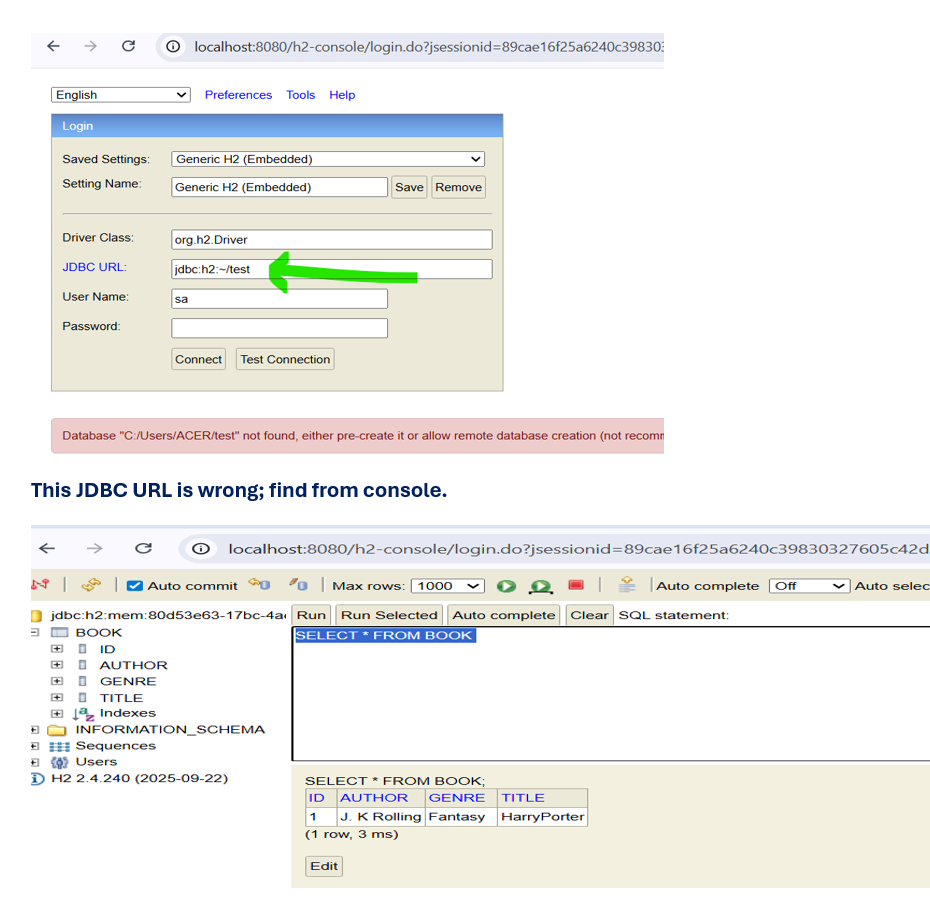
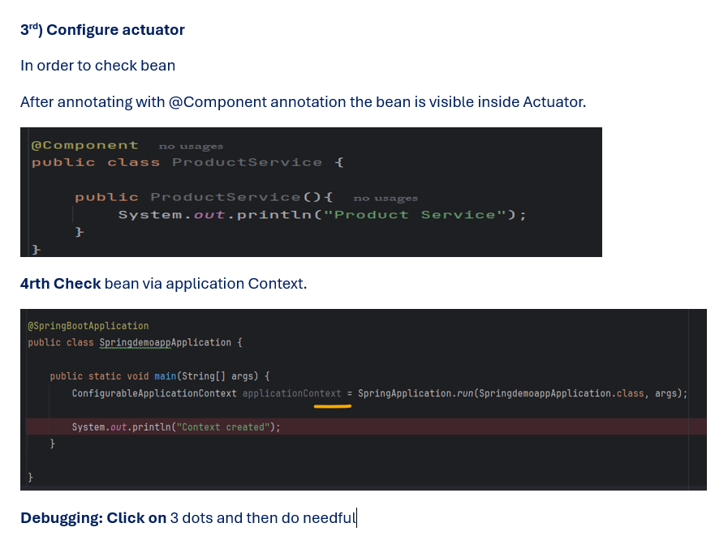

# 1. Crud operations

## Things we encounter
### Adding Book

### See data in h2

### Problem with save () method in PUT mapping

### Coding
### Entity
```java
package com.example.BookApplication.entity;

import jakarta.persistence.Entity;
import jakarta.persistence.GeneratedValue;
import jakarta.persistence.Id;
import lombok.AllArgsConstructor;
import lombok.Data;
import lombok.NoArgsConstructor;

@Entity
@Data  //This give both getter and setters
@NoArgsConstructor
@AllArgsConstructor
public class Book {

    @Id
    @GeneratedValue  //Automatically add this value and increment this value explicitly
    private Integer id;
    private String title;
    private String author;
    private String genre; // genre meaning type

}
```
### Repository
```java
package com.example.BookApplication.repository;

import com.example.BookApplication.entity.Book;
import org.springframework.data.jpa.repository.JpaRepository;

public interface BookRepository extends JpaRepository<Book,Integer> {

   public Book findBookByTitle(String title);
}
```
### Service
```java
package com.example.BookApplication.service;

import com.example.BookApplication.entity.Book;
import com.example.BookApplication.repository.BookRepository;
import org.springframework.beans.factory.annotation.Autowired;
import org.springframework.stereotype.Service;

@Service //Business Logic we add here so annotated with this annotation
public class BookService {

    @Autowired  //Also called as field injection -- on field you added @Autowired
    private BookRepository bookRepository;

    public Book addBook(Book book) {
         return bookRepository.save(book);
    }

    public Book getBookByName(String name) {

        return bookRepository.findBookByTitle(name);
    }

    public Book updateBook(Book book) {
        //save() method is used for add or update
         //But if we use it will create problem since
          // we are using @ID autoincrement

        return bookRepository.save(book);

    }

    public void deleteBook(Integer id) {

        bookRepository.deleteById(id);
    }
}
```
### Controller
```java
package com.example.BookApplication.controller;

import com.example.BookApplication.entity.Book;
import com.example.BookApplication.service.BookService;
import org.springframework.beans.factory.annotation.Autowired;
import org.springframework.http.ResponseEntity;
import org.springframework.web.bind.annotation.*;

@RestController //Response body + Controller
@RequestMapping("/book/v1")  //Common api + version (we can handle from here also)
public class BookController {

   private final BookService bookService;
   //Once you add BookService as final we need to initialize via constructor

    @Autowired // It will inject the dependency - Constructor Injection
    public BookController(BookService bookService) {
        this.bookService = bookService;
    }

    //We are passing json to your application and it will converted into Entity automatically via @RequestBody
    //1. Add Api to add book inside our DB
    @PostMapping("/addBook")
    public ResponseEntity<Book> addBook(@RequestBody Book book){

        Book savedBook = bookService.addBook(book);
        return ResponseEntity.ok(savedBook);
    }


    @GetMapping("/getBook/{bookName}")
    public ResponseEntity<Book> getBookByName(@PathVariable("bookName") String name){

        Book bookByName = bookService.getBookByName(name);
        return ResponseEntity.ok(bookByName);
    }

    @PutMapping("/updateBook")
    public ResponseEntity<Book> updateBook(@RequestBody Book book){

        Book updateBook = bookService.updateBook(book);
        return ResponseEntity.ok(updateBook);
    }


    @DeleteMapping ("/deleteBook/{id}")
    public ResponseEntity<Book> deleteBook(@PathVariable("id") Integer id){

        bookService.deleteBook(id);
        return ResponseEntity.ok().build();
    }
 }
```
### App.prop
```properties

spring.h2.console.enabled=true
spring.datasource.username=root
spring.datasource.password=root12345
```
# 2. Understanding Spring Bean and Bean Lifecycle

### User
```java
package com.example.BookApplication.entity;

import jakarta.annotation.PostConstruct;
import jakarta.annotation.PreDestroy;
import org.springframework.stereotype.Component;


public class User {

    String userName;
    String password;

    // Now we add Parameterized constructor there will be no default constructor right now.
    public User(String userName, String password) {
        System.out.println("User Bean is created");
        this.userName = userName;
        this.password = password;
    }

    @PreDestroy
    public void preDestory(){
        System.out.println("preDestory User");
    }

    @PostConstruct
    public void initialize(){
        System.out.println("Initializing User");
    }
    public String getUserName() {
        return userName;
    }

    public void setUserName(String userName) {
        this.userName = userName;
    }

    public String getPassword() {
        return password;
    }

    public void setPassword(String password) {
        this.password = password;
    }
}
```
### Configuration
```java
package com.example.BookApplication.config;

import com.example.BookApplication.entity.User;
import org.springframework.context.annotation.Bean;
import org.springframework.context.annotation.Configuration;

@Configuration
public class SecurityConfiguration {

    @Bean
    public User createUser(){

        return  new User("John","password");
    }
}
```
### App
```java
package com.example.BookApplication;

import org.springframework.boot.SpringApplication;
import org.springframework.boot.autoconfigure.SpringBootApplication;
import org.springframework.context.ConfigurableApplicationContext;
import org.springframework.context.annotation.ComponentScan;

@SpringBootApplication
public class Application {

	public static void main(String[] args) {
		ConfigurableApplicationContext context = SpringApplication.run(Application.class, args);
		context.close();
	}

}
```
# 3. Spring Boot Project Setup from Scratch

# 4 Understanding Layered Architecture in Spring Boot

### Entity
```java
package com.example.springdemoapp.entity;

import jakarta.persistence.Entity;
import jakarta.persistence.Id;

@Entity
public class Employee {

    @Id
    Integer id;
    String name;
    String dept;
    Integer age;

    public Employee(){

    }
    public Employee(Integer id, String name, String dept, Integer age) {
        this.id = id;
        this.name = name;
        this.dept = dept;
        this.age = age;
    }

    public Integer getId() {
        return id;
    }

    public String getName() {
        return name;
    }

    public String getDept() {
        return dept;
    }

    public Integer getAge() {
        return age;
    }

    public void setId(Integer id) {
        this.id = id;
    }

    public void setName(String name) {
        this.name = name;
    }

    public void setDept(String dept) {
        this.dept = dept;
    }

    public void setAge(Integer age) {
        this.age = age;
    }
}
```
### Repo
```java
package com.example.springdemoapp.repository;

import com.example.springdemoapp.entity.Employee;
import org.springframework.stereotype.Repository;

@Repository
public class EmployeeRepository {

    public Employee getEmployee(Integer id){

        //DB operations, fetch the details from DB
       return new Employee(1,"Aditya","IT",36);
    }
}
```
### Dto
```java
package com.example.springdemoapp.dto;

import com.example.springdemoapp.entity.Employee;

public class EmployeeDTO {

    String name;
    String dept;
    Integer age;

    public void setName(String name) {
        this.name = name;
    }

    public void setDept(String dept) {
        this.dept = dept;
    }

    public void setAge(Integer age) {
        this.age = age;
    }

    public String getName() {
        return name;
    }

    public String getDept() {
        return dept;
    }

    public Integer getAge() {
        return age;
    }

    public EmployeeDTO EmployeMapper(Employee employee){
        this.setName(employee.getName());
        this.setAge(employee.getAge());
        this.setDept(employee.getDept());
        return this;
    }
}
```
### Employee Service
```java
package com.example.springdemoapp.service;

import com.example.springdemoapp.dto.EmployeeDTO;
import com.example.springdemoapp.entity.Employee;
import com.example.springdemoapp.repository.EmployeeRepository;
import org.springframework.beans.factory.annotation.Autowired;
import org.springframework.stereotype.Service;

@Service
public class EmployeeService {

    @Autowired
    EmployeeRepository employeeRepository;

    public EmployeeDTO getEmployee(Integer id){

        Employee employee = employeeRepository.getEmployee(id);

        EmployeeDTO employeeDTO = new EmployeeDTO();
        return employeeDTO.EmployeMapper(employee);
    }
}
```
### Controller
```java
package com.example.springdemoapp.controller;

import com.example.springdemoapp.dto.EmployeeDTO;
import com.example.springdemoapp.service.EmployeeService;
import org.springframework.beans.factory.annotation.Autowired;
import org.springframework.http.ResponseEntity;
import org.springframework.web.bind.annotation.GetMapping;
import org.springframework.web.bind.annotation.PathVariable;
import org.springframework.web.bind.annotation.RestController;

@RestController
public class EmployeeController {

    @Autowired
    EmployeeService employeeService;

    @GetMapping("/getEmployee/{id}")+
    public ResponseEntity<EmployeeDTO> getEmployee(@PathVariable Integer id){

        EmployeeDTO employee = employeeService.getEmployee(id);

        return  ResponseEntity.ok(employee);
    }
}
```
# 5. Spring Annotations

# 6 Understanding Bean and Application Context

### hello