# 7. Component Scan
- Normally @ComponentScan present inside @SpringBootApplication annotation. And the package where it present; It will scan that package and all the subpackage to find bean.
- If you give @ComponentScan i.e. @ComponenetScan(base-package="sth") then it will scan only that package. 
- U can also give mulitple packages in argument in  array {curly braces} - @ComponentScan  i.e. @ComponenetScan(base-package={"sth","Sth"})
- U can also give parent package.
- U can  also provide @component scan in @Configuration class; then it will load both package @SpringBootApplicaton and this other @Configuration class
- U can exclude particular class via excludeFilters= @ComponentScan.Filter(type=FilterType.ASSIGNABLE_TYPE, classes={sth.class})
## PaymentService
```java
package com.example.springdemoapp.service;

public interface PaymentService {
    void processPayment(double amount);
}
```
## GPayService
```java
package com.example.springdemoapp.service;

public class GPayService implements PaymentService{
    @Override
    public void processPayment(double amount) {
        System.out.println("GPay payment processing");
    }
}
```
### CreditCardService
```java
package com.example.springdemoapp.service;

public class CreditCardService implements PaymentService{
    @Override
    public void processPayment(double amount) {
        System.out.println("Credit Card payment processing");
    }
}
```
## PaymentConfig
```java
package com.example.springdemoapp.config;

import com.example.springdemoapp.service.CreditCardService;
import com.example.springdemoapp.service.GPayService;
import com.example.springdemoapp.service.PaymentService;
import org.springframework.context.annotation.Bean;
import org.springframework.context.annotation.Configuration;

@Configuration
public class PaymentConfig {

    @Bean
    public PaymentService creditCardPaymentService(){
        return  new CreditCardService();
    }

    @Bean
    public PaymentService gPayPaymentService(){
        return  new GPayService();
    }
}
```
## DepricatedUtilityService
```java
package com.example.springdemoapp.service;

import org.springframework.stereotype.Service;

@Service
public class DepricatedUtilityService {

    public DepricatedUtilityService() {
        System.out.println("DepricatedUtilityService");
    }
}
```
## EcomUtilityService
```java
package com.example.assistance.service;

import org.springframework.stereotype.Service;

@Service
public class EcomUtilityService {

    public EcomUtilityService() {
        System.out.println("Ecom Utility Service");
    }
}
```
### EcomConfig
```java
package com.example.springdemoapp.config;

import com.example.springdemoapp.service.DepricatedUtilityService;
import org.springframework.context.annotation.ComponentScan;
import org.springframework.context.annotation.Configuration;
import org.springframework.context.annotation.FilterType;

@Configuration
@ComponentScan(basePackages = "com.example.assistance.service",
        excludeFilters = @ComponentScan.Filter(type = FilterType.ASSIGNABLE_TYPE,
        classes = {DepricatedUtilityService.class})
)
public class EcomConfig {
}
```
### SpringdemoappApplication
```java
package com.example.springdemoapp;

import org.springframework.boot.SpringApplication;
import org.springframework.boot.autoconfigure.SpringBootApplication;
import org.springframework.context.ConfigurableApplicationContext;
import org.springframework.context.annotation.ComponentScan;

@SpringBootApplication
//@ComponentScan(basePackages = "com.example")
public class SpringdemoappApplication {

	public static void main(String[] args) {
		ConfigurableApplicationContext applicationContext = SpringApplication.run(SpringdemoappApplication.class, args);

		System.out.println("Context created");
	}

}
```
# 8. Customizing  Nature of bean in Spring lifecycle.
- Custom action 
    - a) Perform some task (initialize sth - initialize DB connection) before bean is ready to use.
    = b) Perform some task( cleaning the memory-- flush, garbage collection) before bean destruction.
- U can implementing the InitializingBean interface  and provide implementaion of afterPropertiesSet() method. So that you  able to initialize sth after bean is created.
- U need to stop your application in-order to run destroy() method which you get via implementing DisposableBean interface. Such that you can do sth before bean destruction.
### BookService
```java
package com.example.BookApplication.service;

import com.example.BookApplication.entity.Book;
import com.example.BookApplication.repository.BookRepository;
import org.springframework.beans.factory.DisposableBean;
import org.springframework.beans.factory.InitializingBean;
import org.springframework.beans.factory.annotation.Autowired;
import org.springframework.stereotype.Service;

@Service
public class BookService  implements InitializingBean, DisposableBean {

    private BookRepository bookRepository;

    @Autowired
    public BookService(BookRepository bookRepository) {
        this.bookRepository = bookRepository;
        System.out.println("BookService");
    }

    @Override
    public void afterPropertiesSet() throws Exception {
        System.out.println("After Property Set");
    }

    @Override
    public void destroy() throws Exception {
        System.out.println("Destory ");
    }

    public Book addBook(Book book) {
         return bookRepository.save(book);
    }

    public Book getBookByName(String name) {

        return bookRepository.findBookByTitle(name);
    }

    public Book updateBook(Book book) {

        return bookRepository.save(book);
    }

    public void deleteBook(Integer id) {

        bookRepository.deleteById(id);
    }

}
```
### context close 
```java
package com.example.BookApplication;

import org.springframework.boot.SpringApplication;
import org.springframework.boot.autoconfigure.SpringBootApplication;
import org.springframework.context.ConfigurableApplicationContext;
import org.springframework.context.annotation.ComponentScan;

@SpringBootApplication
public class Application {

	public static void main(String[] args) {
		ConfigurableApplicationContext context = SpringApplication.run(Application.class, args);
		context.close(); //Close the context explicitly
	}

}
```
### This are old way; new way is to use @PostConstruct and @PreDestroy annotaion
```java
package com.example.BookApplication.service;

import com.example.BookApplication.entity.Book;
import com.example.BookApplication.repository.BookRepository;
import jakarta.annotation.PostConstruct;
import jakarta.annotation.PreDestroy;
import org.springframework.beans.factory.DisposableBean;
import org.springframework.beans.factory.InitializingBean;
import org.springframework.beans.factory.annotation.Autowired;
import org.springframework.stereotype.Service;

@Service
public class BookService   {

    private BookRepository bookRepository;

    @Autowired
    public BookService(BookRepository bookRepository) {
        this.bookRepository = bookRepository;
        System.out.println("BookService");
    }

    @PostConstruct
    public void init(){
        System.out.println("Initialization step ");
    }

    @PreDestroy
    public void destroy(){
        System.out.println("Destroy step before bean destruction");
    }
    public Book addBook(Book book) {
         return bookRepository.save(book);
    }

    public Book getBookByName(String name) {

        return bookRepository.findBookByTitle(name);
    }

    public Book updateBook(Book book) {

        return bookRepository.save(book);
    }

    public void deleteBook(Integer id) {

        bookRepository.deleteById(id);
    }
}
```
### Remember: in order to see sout in destro() method which is annotated via @PreDestroy u neeed to explicitly stop the application context.
# 9. Deep Dive into Spring Bean Scope
## Singleton
- If same hashcode is  inserted everywhere (and found everywhere) then the bean scope is singleton.
- if you don't define any scope then default scope is singleton.
- for defining scope @Scope("singleton") annotation is used
- Remove unused import ctr + alt + o in Intellij 
- In pgm the EmployeeController and UserController are injecting the same bean i.e. User.
- singleton has 2 point
    - default scope
    - eager initialization
### User
```java
package com.example.springdemoapp.entity;

import jakarta.annotation.PostConstruct;
import org.springframework.stereotype.Component;

@Component
public class User {

    public User() {
        System.out.println("User Initialized===>");
    }

    @PostConstruct
    public void init(){
        System.out.println("User object hashcode: "+this.hashCode());
    }
}
```
### UserController
```java
package com.example.springdemoapp.controller;

import com.example.springdemoapp.entity.User;
import jakarta.annotation.PostConstruct;
import org.springframework.beans.factory.annotation.Autowired;
import org.springframework.http.HttpStatus;
import org.springframework.http.ResponseEntity;
import org.springframework.web.bind.annotation.GetMapping;
import org.springframework.web.bind.annotation.RequestMapping;
import org.springframework.web.bind.annotation.RestController;

@RestController
@RequestMapping(value = "/api")
public class UserController {

    @Autowired
    User user;

    public UserController() {
        System.out.println("UserController Init");
    }

    @PostConstruct
    public void init(){
        System.out.println("User Controller hashcode: "+this.hashCode() +
                " User object Hashcode: "+user.hashCode());
    }

    @GetMapping(path = "/fetchUser1")
    public ResponseEntity<String> getUserDetails(){
        System.out.println("Fetch user api");
        return ResponseEntity.status(HttpStatus.OK).body("OK");
    }
}
```
### EmployeeController
```java
package com.example.springdemoapp.controller;

import com.example.springdemoapp.entity.User;
import jakarta.annotation.PostConstruct;
import org.springframework.beans.factory.annotation.Autowired;
import org.springframework.http.HttpStatus;
import org.springframework.http.ResponseEntity;
import org.springframework.web.bind.annotation.GetMapping;
import org.springframework.web.bind.annotation.RequestMapping;
import org.springframework.web.bind.annotation.RestController;

@RestController
@RequestMapping(value = "/api")
public class EmployeeController {

    @Autowired
    User user;

    public EmployeeController() {
        System.out.println("Employee Controller init");
    }

    @PostConstruct
    public void init(){
        System.out.println("Employee Controller hashcode: "+this.hashCode()
         + " User object hashcode: "+user.hashCode());
    }

    @GetMapping(path = "/fetchUser")
    public ResponseEntity<String> getUserDetails(){
        System.out.println("Fetch user api");
        return ResponseEntity.status(HttpStatus.OK).body("OK");
    }
}
```
### Output
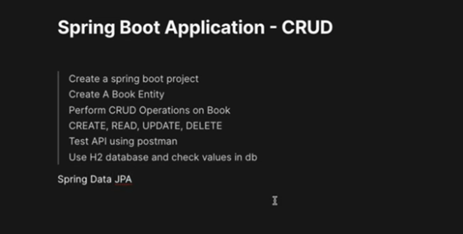
## Prototype Scope
- 2 point
    - Each time new object is created 
    - lazily initialized.(when it is required at that time it is created.)
### Employee class
- Employee class is singleton class
- It has dependency of User; So bean of user is created.
```java
package com.example.springdemoapp.entity;

import jakarta.annotation.PostConstruct;
import org.springframework.beans.factory.annotation.Autowired;
import org.springframework.stereotype.Component;

@Component
public class Employee {

    @Autowired
    User user;

    public Employee(){
        System.out.println("Emoloyee initialized - ->");
    }

    @PostConstruct
    public void init(){
        System.out.println("Employee object hashcode: "+this.hashCode());
    }
}
```
### User class
- User class scope has prototype
- so bean or object of user class is created whenever required.
- since it is used in singleton class Employeee it bean is created.
```java
package com.example.springdemoapp.entity;

import jakarta.annotation.PostConstruct;
import org.springframework.context.annotation.Scope;
import org.springframework.stereotype.Component;

@Component
@Scope("prototype")
public class User {

    public User() {
        System.out.println("User Initialized===>");
    }

    @PostConstruct
    public void init(){
        System.out.println("User object hashcode: "+this.hashCode());
    }
}
```
### UserController
- It scope is prototype 
- so no bean is created right now unitil it is required.
- same with EmployeeController
```java
package com.example.springdemoapp.controller;

import com.example.springdemoapp.entity.User;
import jakarta.annotation.PostConstruct;
import org.springframework.beans.factory.annotation.Autowired;
import org.springframework.context.annotation.Scope;
import org.springframework.http.HttpStatus;
import org.springframework.http.ResponseEntity;
import org.springframework.web.bind.annotation.GetMapping;
import org.springframework.web.bind.annotation.RequestMapping;
import org.springframework.web.bind.annotation.RestController;

@RestController
@RequestMapping(value = "/api")
@Scope("prototype")
public class UserController {

    @Autowired
    User user;

    public UserController() {
        System.out.println("UserController Init");
    }

    @PostConstruct
    public void init(){
        System.out.println("User Controller hashcode: "+this.hashCode() +
                " User object Hashcode: "+user.hashCode());
    }

    @GetMapping(path = "/fetchUser1")
    public ResponseEntity<String> getUserDetails(){
        System.out.println("Fetch user api");
        return ResponseEntity.status(HttpStatus.OK).body("OK");
    }
}
```
### EmployeeController
```java
package com.example.springdemoapp.controller;

import com.example.springdemoapp.entity.Employee;
import com.example.springdemoapp.entity.User;
import jakarta.annotation.PostConstruct;
import org.springframework.beans.factory.annotation.Autowired;
import org.springframework.context.annotation.Scope;
import org.springframework.http.HttpStatus;
import org.springframework.http.ResponseEntity;
import org.springframework.web.bind.annotation.GetMapping;
import org.springframework.web.bind.annotation.RequestMapping;
import org.springframework.web.bind.annotation.RestController;

@RestController
@RequestMapping(value = "/api")
@Scope("prototype")  //Convert the scope to prototype
public class EmployeeController {

    @Autowired
    User user;

    @Autowired
    Employee employee;

    public EmployeeController() {
        System.out.println("Employee Controller init");
    }

     @PostConstruct
    public void init(){
        System.out.println("Employee Controller hashcode: "+this.hashCode()
         + " User object hashcode: "+user.hashCode() + " Employee Object Hashcode: "+employee.hashCode());
    }

    @GetMapping(path = "/fetchUser")
    public ResponseEntity<String> getUserDetails(){
        System.out.println("Fetch user api");
        return ResponseEntity.status(HttpStatus.OK).body("OK");
    }
}
```
### Output till now
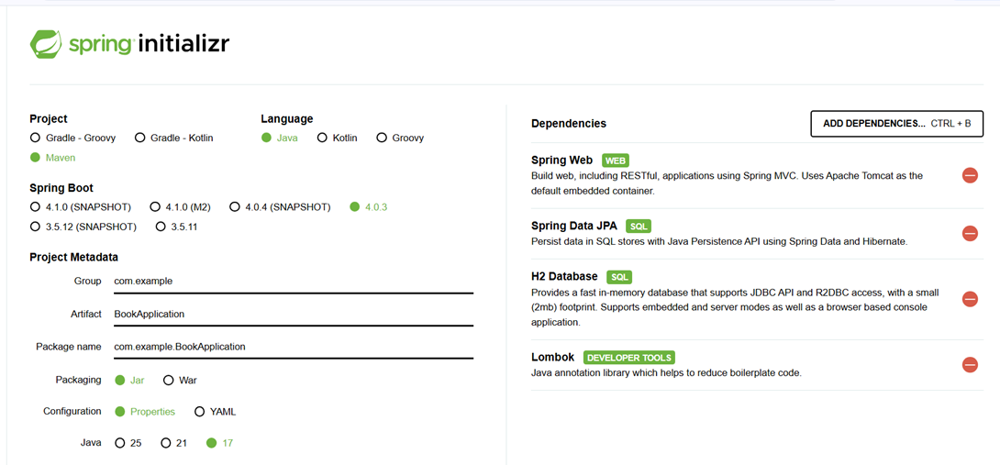
### Now lets hit the api 
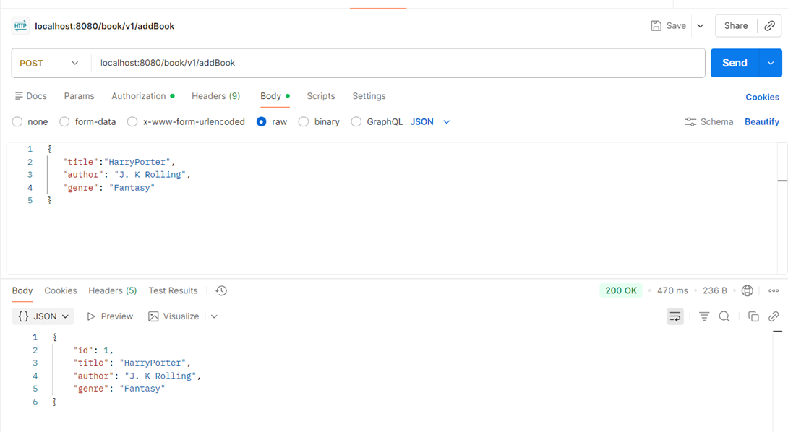
### Analysis
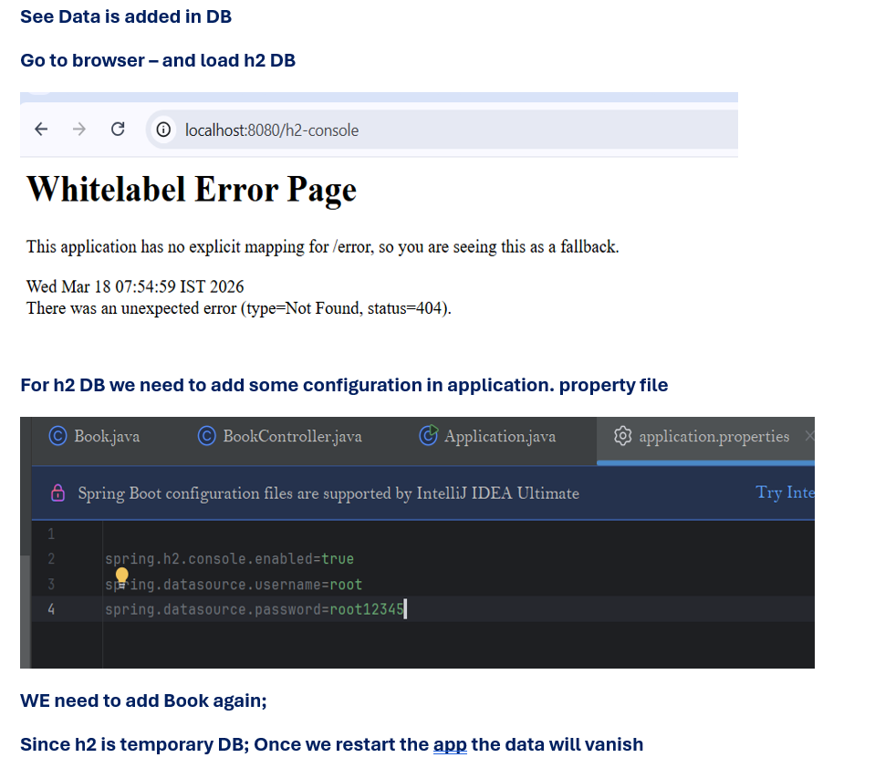
- Employee is singleton bean so as soon as app start it loaded. But it has dependency on User class; User class is prototype scope; But since it is required to bean of user is created followed by bean of Employee
- In EmployeeController scope is prototype
- it require 2 bean to be created; so user scope is prototype so fresh bean is created and for employee scope is singleton so that same bean is injected.
## Request Scope
- 2 point
    - One bean per HTTP Request (diff request diff bean)
    - Lazily initialized
- So Employee scope is prototype and rest scope is request.
- when we run the app no bean is created. This is expected since scope is either request and prototype and not singleton.
### User
```java
package com.example.springdemoapp.entity;

import jakarta.annotation.PostConstruct;
import org.springframework.context.annotation.Scope;
import org.springframework.stereotype.Component;

@Component
@Scope("request")
public class User {

    public User() {
        System.out.println("User Initialized===>");
    }

    @PostConstruct
    public void init(){
        System.out.println("User object hashcode: "+this.hashCode());
    }
}
```
### Empl
```java
package com.example.springdemoapp.entity;

import jakarta.annotation.PostConstruct;
import org.springframework.beans.factory.annotation.Autowired;
import org.springframework.context.annotation.Scope;
import org.springframework.stereotype.Component;

@Component
@Scope("prototype")
public class Employee {

    @Autowired
    User user;

    public Employee(){
        System.out.println("Emoloyee initialized - ->");
    }

    @PostConstruct
    public void init(){
        System.out.println("Employee object hashcode: "+this.hashCode() +
                " User object hascode: "+user.hashCode());
    }
}
```
### UserCont
```java
package com.example.springdemoapp.controller;

import com.example.springdemoapp.entity.User;
import jakarta.annotation.PostConstruct;
import org.springframework.beans.factory.annotation.Autowired;
import org.springframework.context.annotation.Scope;
import org.springframework.http.HttpStatus;
import org.springframework.http.ResponseEntity;
import org.springframework.web.bind.annotation.GetMapping;
import org.springframework.web.bind.annotation.RequestMapping;
import org.springframework.web.bind.annotation.RestController;

@RestController
@RequestMapping(value = "/api")
@Scope("request")
public class UserController {

    @Autowired
    User user;

    public UserController() {
        System.out.println("UserController Init");
    }

    @PostConstruct
    public void init(){
        System.out.println("User Controller hashcode: "+this.hashCode() +
                " User object Hashcode: "+user.hashCode() );
    }

    @GetMapping(path = "/fetchUser1")
    public ResponseEntity<String> getUserDetails(){
        System.out.println("Fetch user api");
        return ResponseEntity.status(HttpStatus.OK).body("OK");
    }
}
```
### EmpCon
```java
package com.example.springdemoapp.controller;

import com.example.springdemoapp.entity.Employee;
import com.example.springdemoapp.entity.User;
import jakarta.annotation.PostConstruct;
import org.springframework.beans.factory.annotation.Autowired;
import org.springframework.context.annotation.Scope;
import org.springframework.http.HttpStatus;
import org.springframework.http.ResponseEntity;
import org.springframework.web.bind.annotation.GetMapping;
import org.springframework.web.bind.annotation.RequestMapping;
import org.springframework.web.bind.annotation.RestController;

@RestController
@RequestMapping(value = "/api")
@Scope("request")  //Convert the scope to request
public class EmployeeController {

    @Autowired
    User user;

    @Autowired
    Employee employee;

    public EmployeeController() {
        System.out.println("Employee Controller init");
    }

    @PostConstruct
    public void init(){
        System.out.println("Employee Controller hashcode: "+this.hashCode()
         + " User object hashcode: "+user.hashCode() + " Employee Object Hashcode: "+employee.hashCode());
    }

    @GetMapping(path = "/fetchUser")
    public ResponseEntity<String> getUserDetails(){
        System.out.println("Fetch user api");
        return ResponseEntity.status(HttpStatus.OK).body("OK");
    }
}
```
### Output
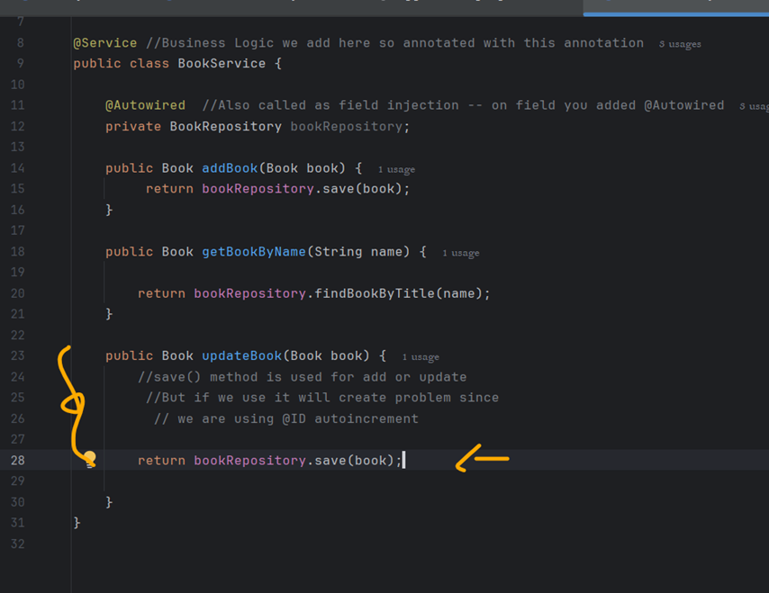
### Analysis
- When we hit EmployeeController class; It's constructor is called; Then it see it has dependency so first User bean is created;
- Since user bean scope is prototype but it is in same request. So User bean is created.
- then it create employee bean which has dependency on User bean; So user has scope request; So it check wheather the user bean is already created inject that.
### Now give some space and hit the same request again
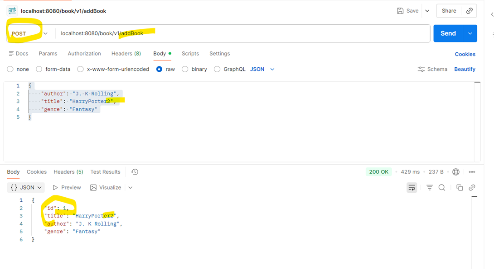
### Other sceanario- lets make employee bean scope as singleton
### Emp
```java
package com.example.springdemoapp.entity;

import jakarta.annotation.PostConstruct;
import org.springframework.beans.factory.annotation.Autowired;
import org.springframework.context.annotation.Scope;
import org.springframework.stereotype.Component;

@Component
public class Employee {

    @Autowired
    User user;

    public Employee(){
        System.out.println("Emoloyee initialized - ->");
    }

    @PostConstruct
    public void init(){
        System.out.println("Employee object hashcode: "+this.hashCode() +
                " User object hascode: "+user.hashCode());
    }
}
```
### Analysis
- Employee scope is singleton
- It has dependency on user which has scope request
- So As soon as app starts the employee bean needs to be initialized 
- We won't give any hit to postman so user whcih has scope request won't initialized.
### Error output
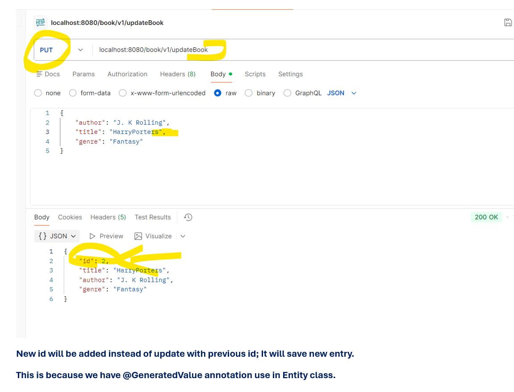
### Solution of above scenario
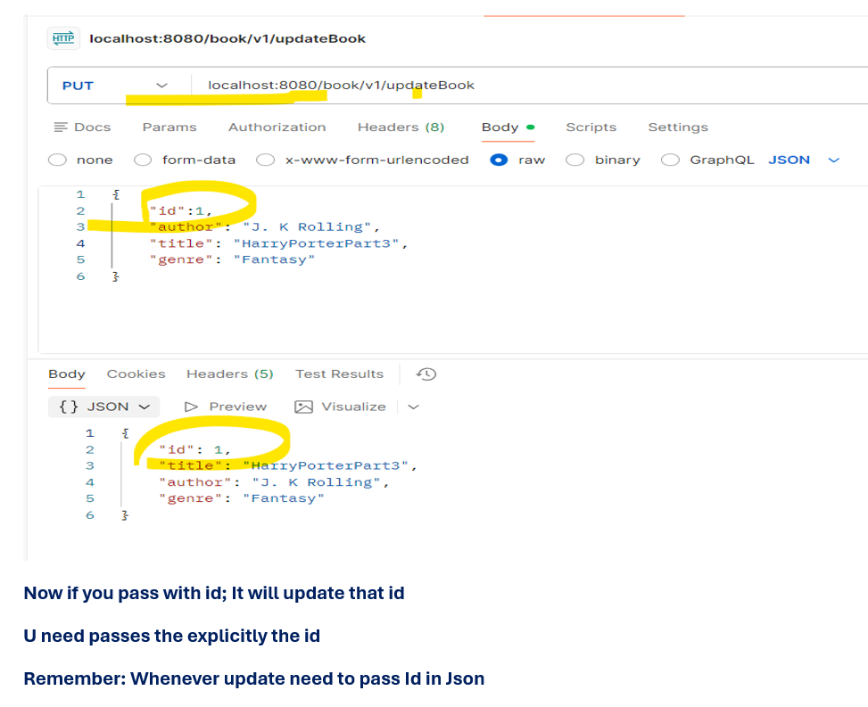
- proxyMode = ScopedProxyMode.TARGET_CLASS
- It is used to create class based proxy.
- It will create proxy of user and inject in employee
###
```java
package com.example.springdemoapp.entity;

import jakarta.annotation.PostConstruct;
import org.springframework.context.annotation.Scope;
import org.springframework.context.annotation.ScopedProxyMode;
import org.springframework.stereotype.Component;

@Component
@Scope(value = "request",proxyMode = ScopedProxyMode.TARGET_CLASS)
public class User {

    public User() {
        System.out.println("User Initialized===>");
    }

    @PostConstruct
    public void init(){
        System.out.println("User object hashcode: "+this.hashCode());
    }
}
```
### ouptut
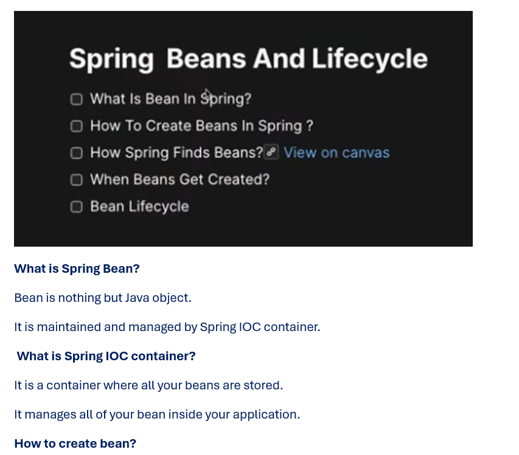
- User constructor statement is  not printed.
- and the statemnet inside @PostConstruct is not printed.
### Now hit the api
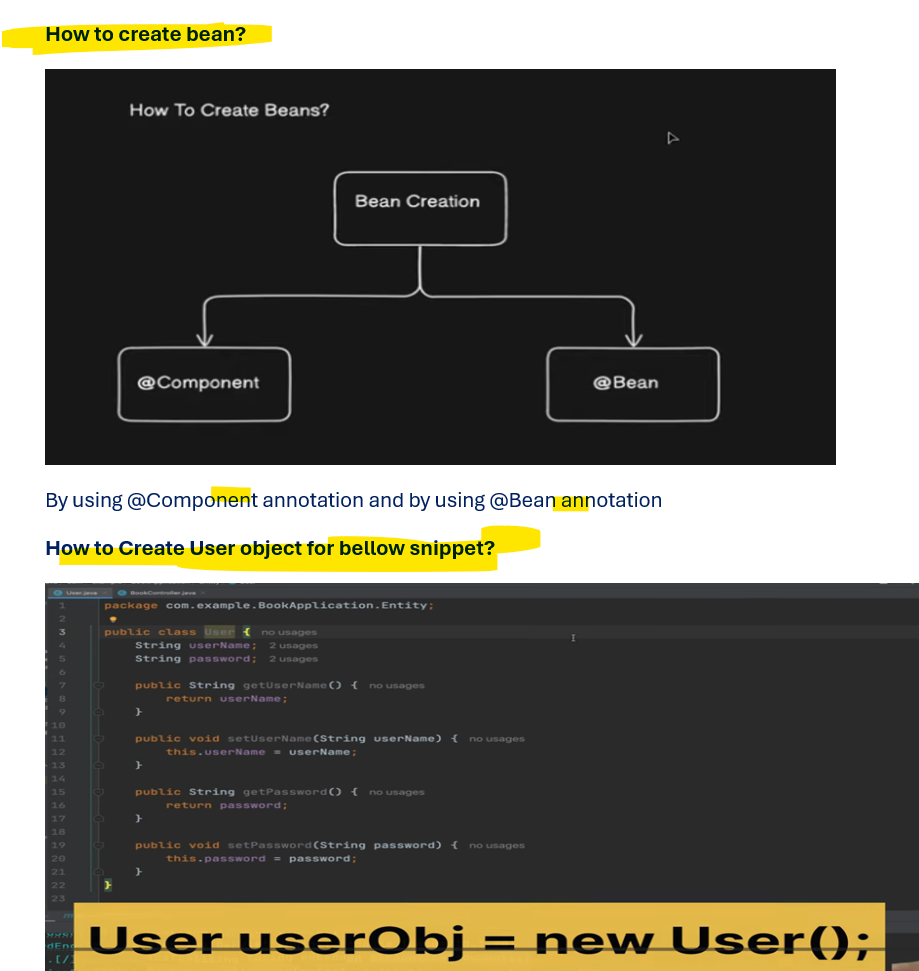
- Remember ***proxymode*** it comes when you try to injecting for singleton scope bean.
## Session Scope
- New object for Http Session(instead of request)
- lazily initialized
- When user access any api session is created(there will be multiple request in your session)
- Once user logout the session is destroy. (once login then new session start)
- Remains active till session is expired.
- User have singleton scope just check
###
```java
package com.example.springdemoapp.entity;

import jakarta.annotation.PostConstruct;
import org.springframework.context.annotation.Scope;
import org.springframework.context.annotation.ScopedProxyMode;
import org.springframework.stereotype.Component;

@Component
public class User {

    public User() {
        System.out.println("User Initialized===>");
    }

    @PostConstruct
    public void init(){
        System.out.println("User object hashcode: "+this.hashCode());
    }
}
```
### EmpCon
```java
package com.example.springdemoapp.controller;

import com.example.springdemoapp.entity.User;
import jakarta.annotation.PostConstruct;
import org.springframework.beans.factory.annotation.Autowired;
import org.springframework.context.annotation.Scope;
import org.springframework.http.HttpStatus;
import org.springframework.http.ResponseEntity;
import org.springframework.web.bind.annotation.GetMapping;
import org.springframework.web.bind.annotation.RequestMapping;
import org.springframework.web.bind.annotation.RestController;

@RestController
@RequestMapping(value = "/api")
@Scope("session")  //Convert the scope to session
public class EmployeeController {

    @Autowired
    User user;

    public EmployeeController() {
        System.out.println("Employee Controller init");
    }

    @PostConstruct
    public void init() {
        System.out.println("Employee Controller hashcode: " + this.hashCode() +
                " User object hashcode: " + user.hashCode());
    }

    @GetMapping(path = "/fetchUser")
    public ResponseEntity<String> getUserDetails() {
        System.out.println("Fetch user api");
        return ResponseEntity.status(HttpStatus.OK).body("OK");
    }
}
```
### output
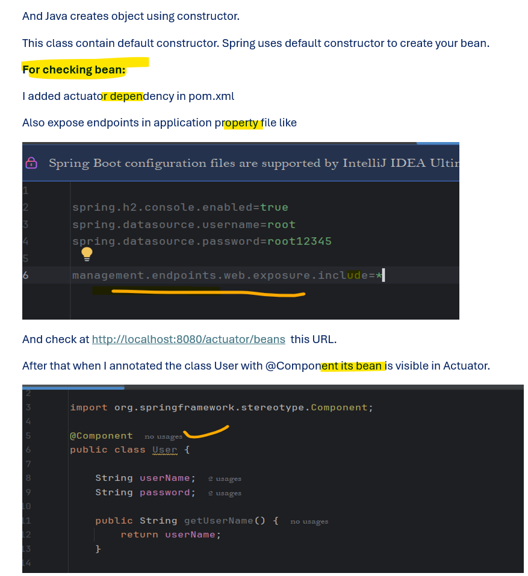
### Invoke api from browser
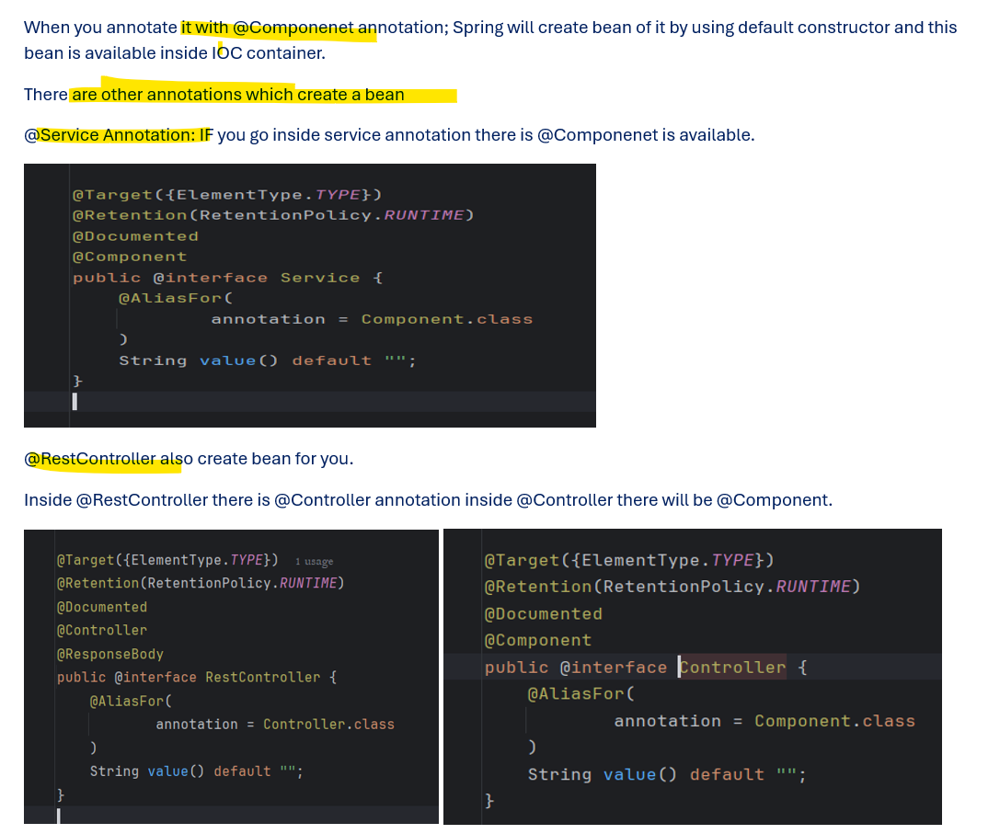
- Again refresh it 
### Output
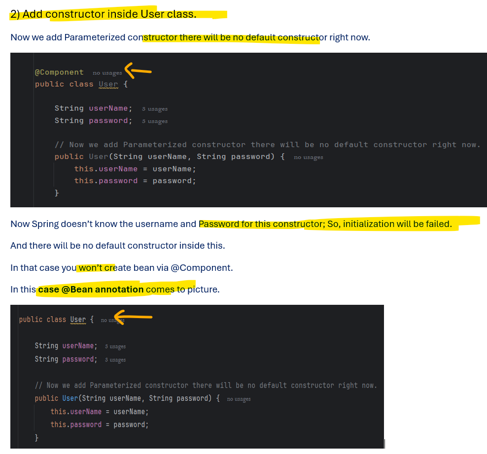
- EmpCon  bean is not created
### How to expire the session
```java
package com.example.springdemoapp.controller;

import com.example.springdemoapp.entity.User;
import jakarta.annotation.PostConstruct;
import jakarta.servlet.http.HttpServletRequest;
import org.springframework.beans.factory.annotation.Autowired;
import org.springframework.context.annotation.Scope;
import org.springframework.http.HttpStatus;
import org.springframework.http.ResponseEntity;
import org.springframework.web.bind.annotation.GetMapping;
import org.springframework.web.bind.annotation.RequestMapping;
import org.springframework.web.bind.annotation.RestController;

@RestController
@RequestMapping(value = "/api")
@Scope("session")  //Convert the scope to session
public class EmployeeController {

    @Autowired
    User user;

    public EmployeeController() {
        System.out.println("Employee Controller init");
    }

    @PostConstruct
    public void init() {
        System.out.println("Employee Controller hashcode: " + this.hashCode() +
                " User object hashcode: " + user.hashCode());
    }

    @GetMapping(path = "/fetchUser")
    public ResponseEntity<String> getUserDetails() {
        System.out.println("Fetch user api");
        return ResponseEntity.status(HttpStatus.OK).body("OK");
    }

    @GetMapping(path = "/logout")
    public ResponseEntity<String> logout(HttpServletRequest request) {
        System.out.println("logut employeeController api");
        request.getSession().invalidate();
        return ResponseEntity.status(HttpStatus.OK).body("OK");
    }
}
```
### hit and logout
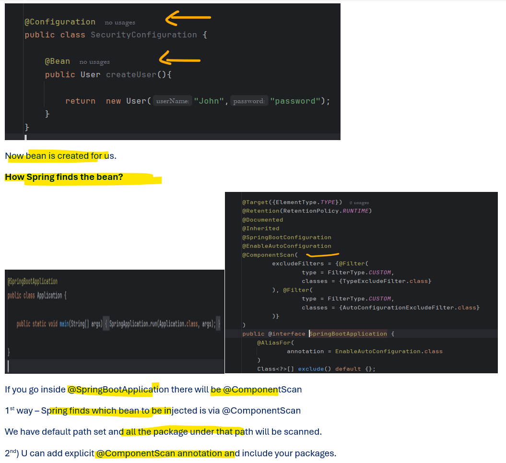
- Employee controller hashcode is changes as per seesion
## 28Mar2026


