# 10. Understanding @Primary and @Qualifier annotation
### Problem
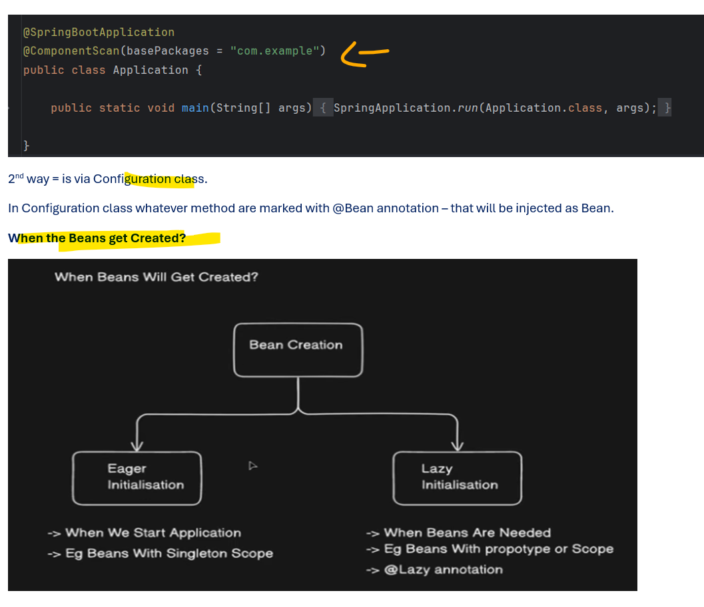
### 
```java
public interface PaymentService {
    void processPayment(double amount);
}
```
###
```java
@Service
public class GPayService implements PaymentService{

    @Override
    public void processPayment(double amount) {
        System.out.println("GPay payment processing");
    }
}
```
### 
```java
@Service
public class CreditCardService implements PaymentService{

    @Override
    public void processPayment(double amount) {
        System.out.println("Credit Card payment processing");
    }
}
```
### Issue happen here in Checkout Service
```java
@Service
public class CheckoutService {

    @Autowired
    PaymentService paymentService;

    public void checkoutOrder(double amount){

        paymentService.processPayment(amount);
        System.out.println("checkout order for amount "+amount);
    }
}
```
### Problem Analysis
- We are trying to inject Payment service which has 2 implementation CreditCardService and GPayService which one to take.
### Solution 
- Need to injected bean of GpayService in PaymentService vai @Qualifier annotation
###
```java
@Service
public class CheckoutService {

    @Autowired
    @Qualifier("GPayService")
    PaymentService paymentService;

    @PostConstruct
    public void init(){
        System.out.println("Checkout Service init");
    }
    
    public void checkoutOrder(double amount){

        paymentService.processPayment(amount);
        System.out.println("checkout order for amount "+amount);
    }
}
```
### In case of Constructor Injection
```java
@Service
public class CheckoutService {


    private final PaymentService paymentService;

    public CheckoutService(@Qualifier("creditCardService") PaymentService paymentService) {
        this.paymentService = paymentService;
    }

    @PostConstruct
    public void init(){
        System.out.println("Checkout Service init");
    }

    public void checkoutOrder(double amount){

        paymentService.processPayment(amount);
        System.out.println("checkout order for amount "+amount);
    }
}
```
### Creating problem and solving them via @Primary annotation
```java
@Service
public class CheckoutService {


    private final PaymentService paymentService;

    public CheckoutService(PaymentService paymentService) {
        this.paymentService = paymentService;
    }

    @PostConstruct
    public void init(){
        System.out.println("Checkout Service init");
    }

    public void checkoutOrder(double amount){

        paymentService.processPayment(amount);
        System.out.println("checkout order for amount "+amount);
    }
}
```
### Error
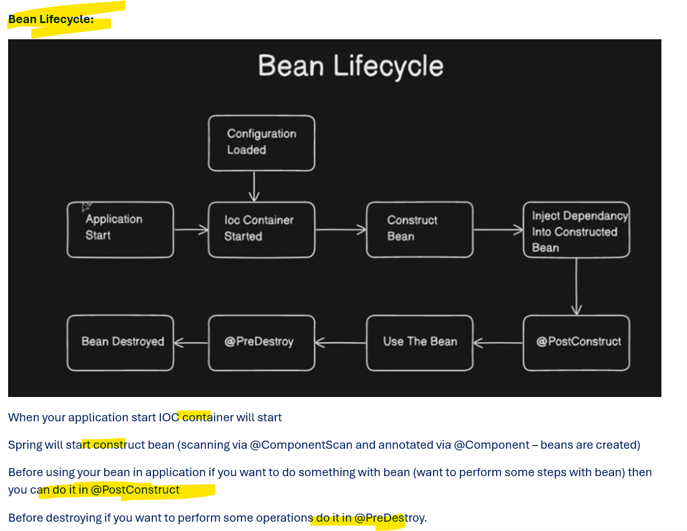
### 
```java
@Service
@Primary
public class DefaultPaymentService implements PaymentService{

    @Override
    public void processPayment(double amount) {
        System.out.println("DefaultPaymentService");
    }
}
```
### What if we have both annotation
```java
@Service
public class CheckoutService {


    private final PaymentService paymentService;

    public CheckoutService(@Qualifier("GPayService") PaymentService paymentService) {
        this.paymentService = paymentService;
    }

    @PostConstruct
    public void init(){
        System.out.println("Checkout Service init");
    }

    public void checkoutOrder(double amount){

        paymentService.processPayment(amount);
        System.out.println("checkout order for amount "+amount);
    }
}
```
### GpayService is injection. This means @Qualifier annotation has more precendence over @Primary annotaiton
### When to use 
### @Primary
- when we have default choice of dependency injection in multiple beans
### @Qualifier
- Specify bean over multiple beans of same time
# 11. Mastering @ConditionalOnProperty
### Why we need @ConditionalOnProperty annotation.
- Let say we have thousand bean; When our appliation start this thousand bean created in application context.
- Due to this act our application context is getting cluttered with thousand bean.
- We require only few bean when application start up. Not thousand of bean.
- So in order to decluttered the bean the @CondtionalOnProperty annotation comes in picture.
### What is @ConditionalOnProperty?
- With this Bean is created conditionally.
- When we want to create bean on some condition then this annotation is useful.
- condition is true bean is created. vice versa
###
```java
@Component
public class MySqlConnection {

    public MySqlConnection() {
        System.out.println("MySqlConnection init");
    }
}
```
###
```java
@Component
public class NoSqlConnection {

    public NoSqlConnection() {
        System.out.println("NoSqlConnection init");
    }
}
```
###
```java
@Component
public class DBConnection {

    @Autowired
    MySqlConnection mySqlConnection;

    @Autowired
    NoSqlConnection noSqlConnection;

    @PostConstruct
    public void init(){
        System.out.println("DBConnection init");
        System.out.println("MySqlConnection: "+mySqlConnection);
        System.out.println("NoSqlConnection: "+noSqlConnection);
    }
}
```
### Output
```
MySqlConnection init
NoSqlConnection init
DBConnection init
MySqlConnection: com.example.springdemoapp.dbConnection.MySqlConnection@15c3585
NoSqlConnection: com.example.springdemoapp.dbConnection.NoSqlConnection@5b86f4cb
```
## Scenario to handle
### 1) we want to create only 1 bean either MySqlConnection or NoSqlConnection, Ongoing  Requirement is like company earlier uses MySqlConn right now migrate to Nosql
### 
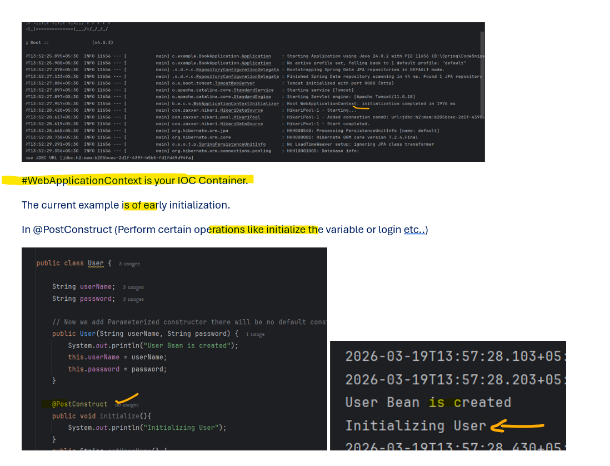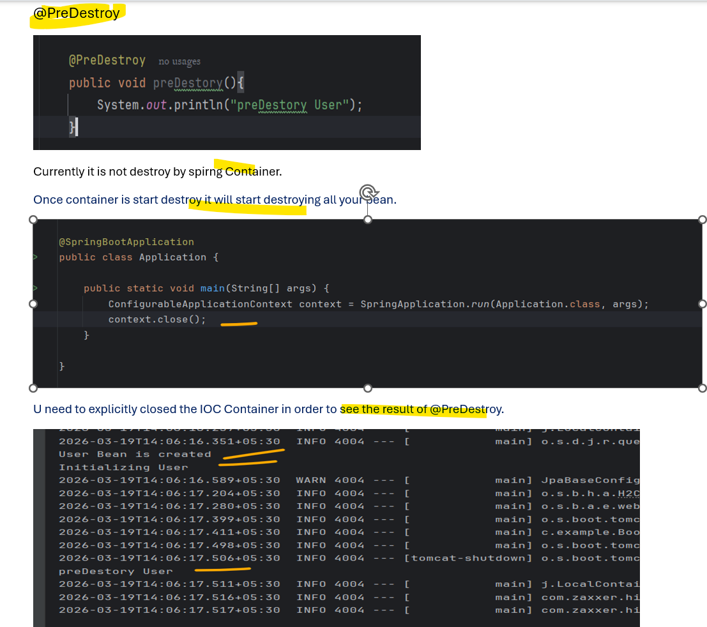
### 2) Application A require SQL conn and depends on commonCode base and vice versa.
### Explain Attributes use in @CondtionalOnProperty annotation
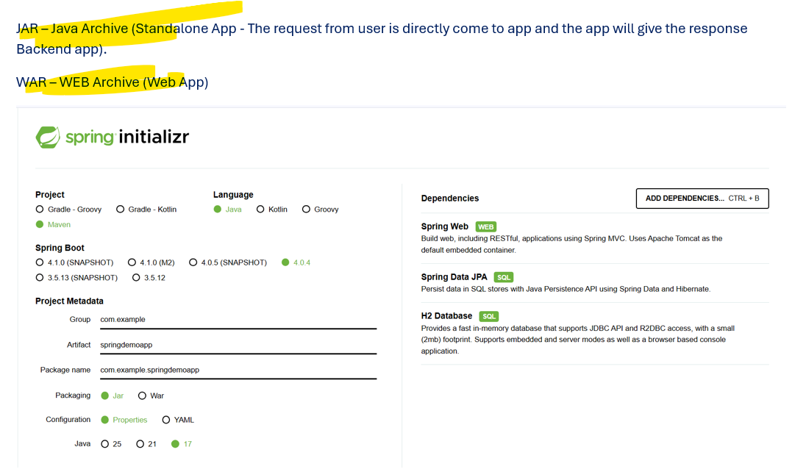
### Importance of @Autowired(require=false)
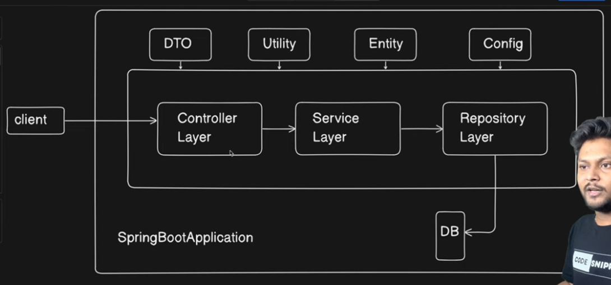
###
```java
@Component
@ConditionalOnProperty(prefix = "noSqlConnection",
        value = "enabled",
        havingValue = "true",
        matchIfMissing = false)
public class NoSqlConnection {

    public NoSqlConnection() {
        System.out.println("NoSqlConnection init");
    }
}
```
###
```java
@Component
@ConditionalOnProperty(prefix = "sqlConnection",
        value = "enabled",
        havingValue = "create",
        matchIfMissing = false)
public class MySqlConnection {

    public MySqlConnection() {
        System.out.println("MySqlConnection init");
    }
}
```
### app.prop
```properties
noSqlConnection.enabled=true

sqlConnection.enabled=create
```
###
```java
@Component
public class DBConnection {

    @Autowired(required = false)
    MySqlConnection mySqlConnection;

    @Autowired(required = false)
    NoSqlConnection noSqlConnection;

    @PostConstruct
    public void init(){
        System.out.println("DBConnection init");
        System.out.println("MySqlConnection: "+mySqlConnection);
        System.out.println("NoSqlConnection: "+noSqlConnection);
    }
}
```
### Output
```
MySqlConnection init
NoSqlConnection init
DBConnection init
MySqlConnection: com.example.springdemoapp.dbConnection.MySqlConnection@4803bf73
NoSqlConnection: com.example.springdemoapp.dbConnection.NoSqlConnection@13731ff4
````
### And if you change in app.prop
```properties
noSqlConnection.enabled=false

sqlConnection.enabled=dontcreate
```
### Output:
```
DBConnection init
MySqlConnection: null
NoSqlConnection: null
```
### Excepion scenario of @Autowired(require=false) we already covered.
### MatchIFMissing comes to picture
- We delete all propeties from app.property and run the app
### Output
```
DBConnection init
MySqlConnection: null
NoSqlConnection: null
```
### Since our matchIfMissin property we set at false let set to true
```java
@Component
@ConditionalOnProperty(prefix = "noSqlConnection",
        value = "enabled",
        havingValue = "true",
        matchIfMissing = true)
public class NoSqlConnection {

    public NoSqlConnection() {
        System.out.println("NoSqlConnection init");
    }
}
```
### Output
```
NoSqlConnection init
DBConnection init
MySqlConnection: null
NoSqlConnection: com.example.springdemoapp.dbConnection.NoSqlConnection@222eda8a
```
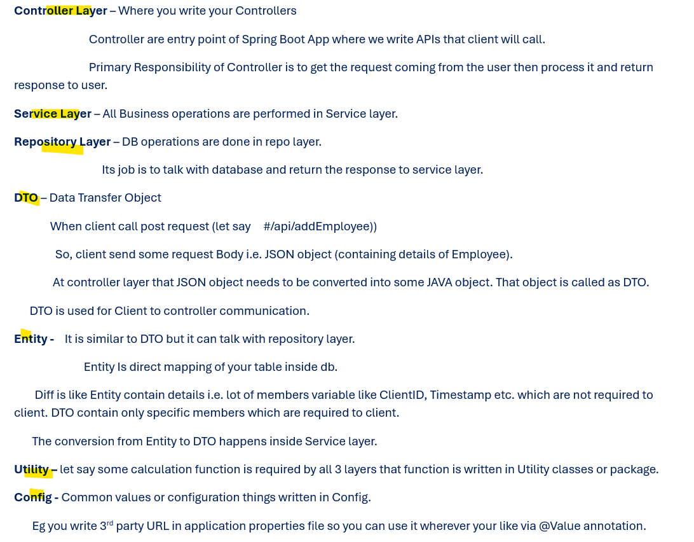
# 12. Mastering Spring profiles
###
```
  U configure your local m/c property in 
    application.property
	
    
   and fetch it via @Value("${value}") annotaition
   ```
###
```properties
spring.application.name=springdemoapp

management.endpoints.web.exposure.include=*

username=devUserName
password=devPassword
```
### 
```java
@Component
public class DBConnection {

    @Value("${username}")
    String username;

    @Value("${password}")
    String password;

    @PostConstruct
    public void init(){
        System.out.println("DBConnection init");
        System.out.println("username: "+username+ " |  password: "+password);
    }
}
```
###
```
Why ***profiling*** is needed?
   U are working in local m/c. You have to work with DB.
   So local m/c DB connections username, password and other configuration you write in  application.properties
   
   When you deploy your application on qa so there db username and password are different.
   So again you need to change the application.property file. In order to DB connections work.
   
   Again you deployed app to prod same issue you encounter.
   
   So to handle this part profiling comes to picture.

    How to handle different configuration in different enviornments?
    via profiles.
```
###   Create diff application.properties for different enviornments
### app.prop
```properties
spring.application.name=springdemoapp

management.endpoints.web.exposure.include=*

userNames=userName
password=password
```
### dev
```properties
userNames=devUserName
password=devPassword
```
### qa
```properties
userNames=qaUserName
password=qaPassword
```
### prod
```properties
userNames=prodUserName
password=prodPassword
```
### How to set the profile. Go to app.property parent proeprty
```properties
spring.application.name=springdemoapp

management.endpoints.web.exposure.include=*

userNames=userName
password=password

spring.profiles.active=dev
```
### Output
```
DBConnection init
username: devUserName |  password: devPassword
```
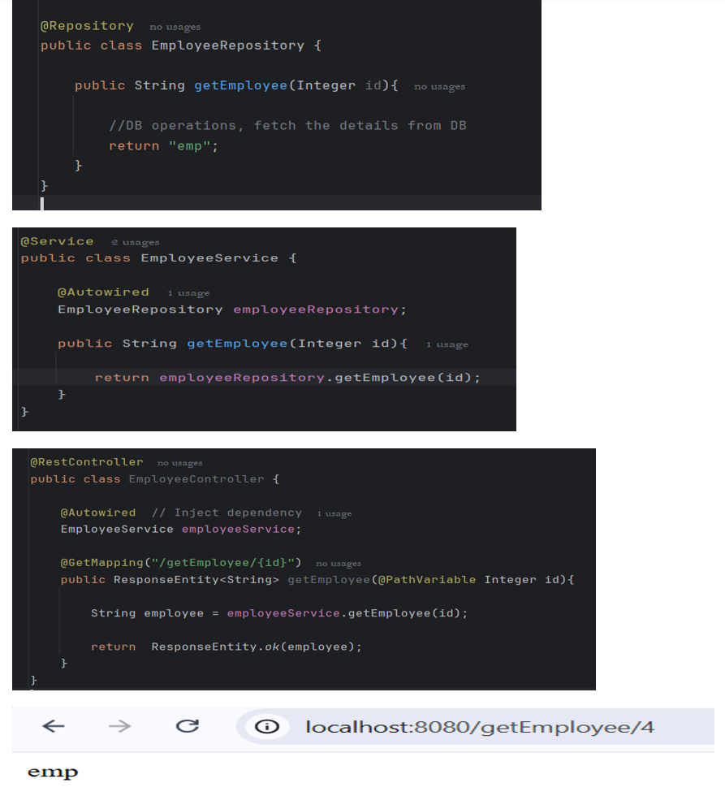
### What happen in below scenario.
```
You set in app.properties
   spring.profiles.active=qa
   
   and you delete qa.prorty file.
   Then it will fetching value from parent property file
     ie. username= username and password = password
```
###  Other Scenario
```
 You set in application.properties file
   
    spring.profiles.active=dev
	
	and application-dev.properties file also exist but username and password are not present there
	
	In that case again ouput will be comming from parent property file
	ie. username= username and password = password
```
###  One more Scenario
``` 
   You set in application.properties file
   
    spring.profiles.active=dev
	
	and application-dev.properties file also exist but username and password are not present there
	also in parent application.properties file username and password are not present
	Then what happen in that scenario.
	
	U encounter with an execption. 
```
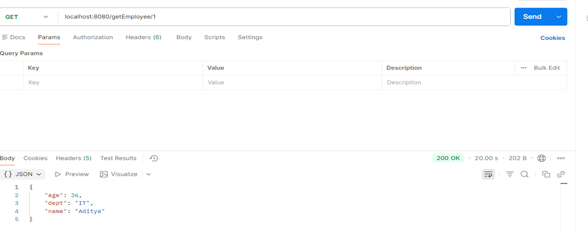
###  How to configure profile dynamically?
```
 Till now we need to configure 
	   spring.profiles.active = dev or qa  inside application.properties file manually
	   
	 So we need dynamic configuration.
	 We can do this in 2 way
	 
	1) Startup an application via command
		mvn spring-boot:run-Dspring-boot.run.profiles=prod
	 
	mvn spring-boot:run == instruction for running spring boot application.
	-Dspring-boot.run.profiles=prod  :- Setting parameter while running your application dynamically.
 ```
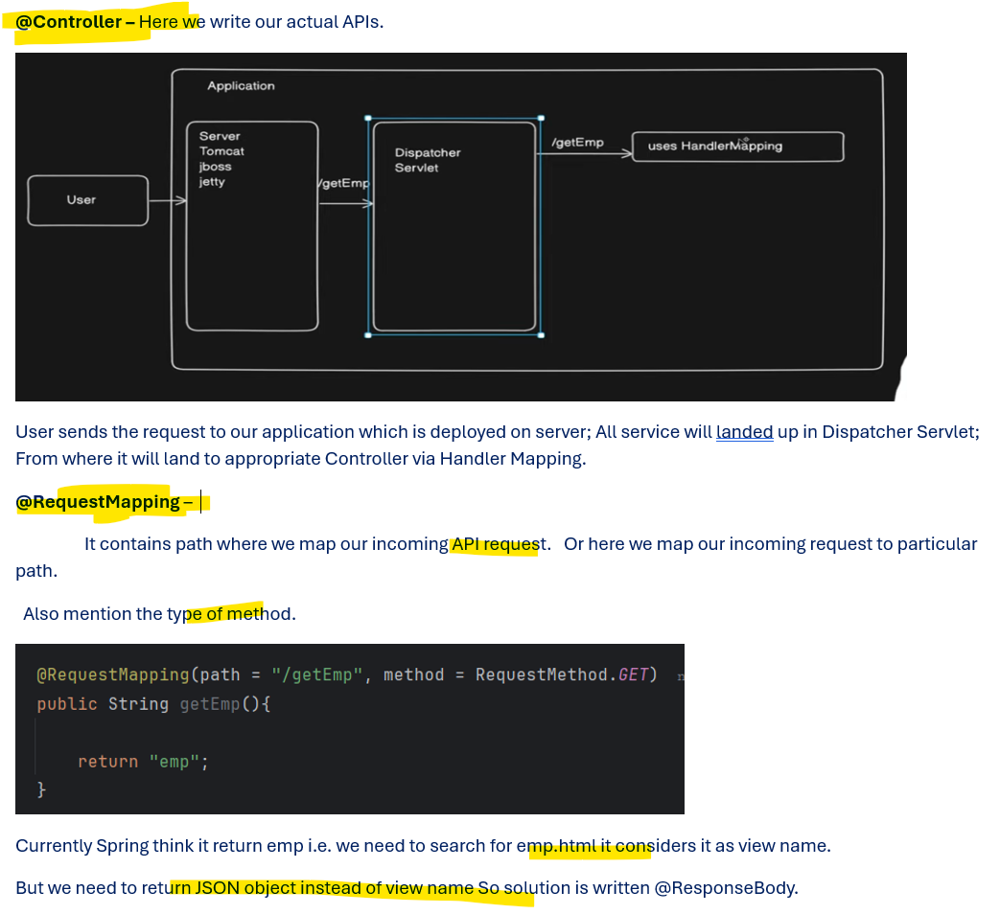
### In Pom.xml- Other way is adding profiles in pom.xml
```xml
<profiles>
		<profile>
			<id>local</id>
			<properties>
				<spring-boot.run.profiles>dev</spring-boot.run.profiles>
			</properties>
		</profile>

		<profile>
			<id>production</id>
			<properties>
				<spring-boot.run.profiles>prod</spring-boot.run.profiles>
			</properties>
		</profile>
	</profiles>
```
### and run using command 
-   mvn spring-boot:run -P local //running profiel whose id is local
### @Profile annotations
-    Using @Profile annotation we tell spring boot, Create a bean only when particular profile is set.   
- When i set profile to dev then only mySql bean is injected inside my application.
### dev
```properties
userNames=devUserName
password=devpassword
```
### app.prop
```properties
spring.application.name=springdemoapp

management.endpoints.web.exposure.include=*

userNames=UserName
password=password

spring.profiles.active=dev
```
### db
```java
@Component
@Profile("dev")
public class MySqlConnection {

    @Value("${userNames}")
    String userName;

    @Value("${password}")
    String password;

    @PostConstruct
    public void init() {
        System.out.println("MySqlConnection init");
        System.out.println("username: "+userName+ " |  password: "+password);
    }
}
```
### Analysis:
```
MySql Connection bean is injected only when profiles is set to dev.
In app.properties file spring.profiles.active=dev 
and see @Profile("dev") annotation on top of MySqlConnection
```
### output
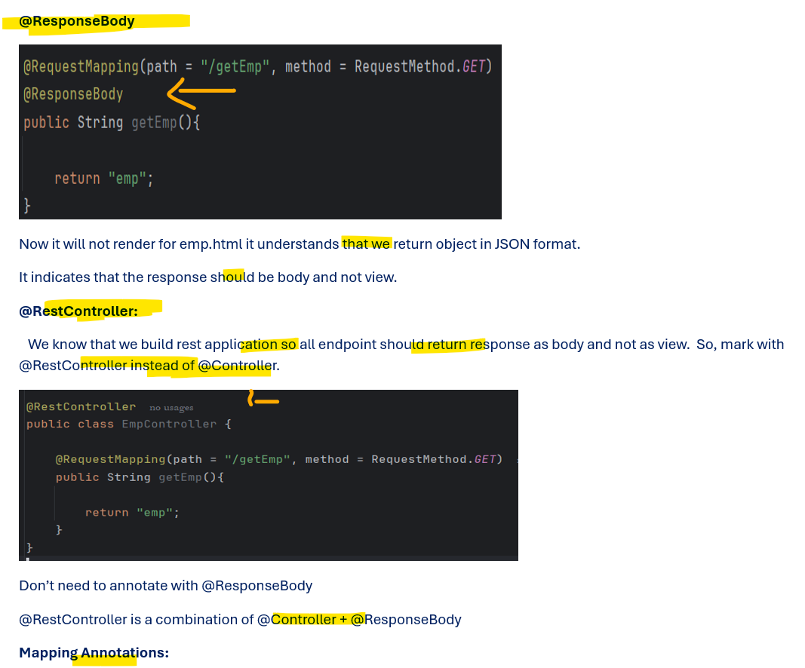
```
DBConnection init
username: devUserName |  password: devpassword
MySqlConnection init
username: devUserName |  password: devpassword
```
### What happen if profile is prod i.e. spring.profiles.active=prod
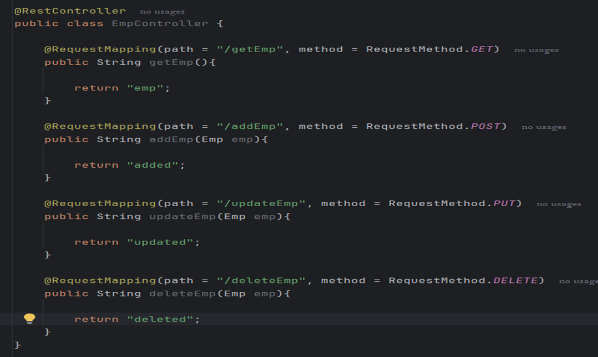
- MysqlConnection bean won't be created.
###
```
	@Profile annotation is tell an application
	Inject the bean or not to inject the bean 
	
	In certain environment some bean you want injected. while in other env you don't want to inject that bean.
	This problem is solved by @Profile.
```
### u can write in this way also spring.profiles.active=prod,dev
- so the profile which last it will be pick between two. But this won't make sense.
# 13. Master Exception Handling in Spring Boot
### Tradtiditional approach
##
```java
@Entity
public class Product {

    @Id
    @GeneratedValue(strategy = GenerationType.IDENTITY)
    private Integer id;
    private String name;
    private Double price;
    private String description;

    public Product() {
    }

    public Product(Integer id, String name, Double price, String description) {
        this.id = id;
        this.name = name;
        this.price = price;
        this.description = description;
    }

    public Integer getId() {
        return id;
    }

    public void setId(Integer id) {
        this.id = id;
    }

    public String getName() {
        return name;
    }

    public void setName(String name) {
        this.name = name;
    }

    public Double getPrice() {
        return price;
    }

    public void setPrice(Double price) {
        this.price = price;
    }

    public String getDescription() {
        return description;
    }

    public void setDescription(String description) {
        this.description = description;
    }
}
```
### 
```java
public interface ProductRepository extends JpaRepository<Product,Integer> {

    Optional<Product> findByName(String name);
}
```
###
```java
@Service
public class ProductService {

    @Autowired
    private ProductRepository productRepository;

    public Product addProduct(Product product){
        return productRepository.save(product);
    }

    public Optional<Product> findById(Integer id){
        return productRepository.findById(id);
    }

    public Optional<Product> findByName(String name){
        return productRepository.findByName(name);
    }

    public List<Product> getAllProducts(){
        return productRepository.findAll();
    }
}
```
###
```java
@RestController
@RequestMapping("/product/v1")
public class ProductController {

    @Autowired
    ProductService productService;

    @GetMapping("/getProduct/{productId}")
    public ResponseEntity<Product> getProductById(@PathVariable("productId") Integer productId){
        Product product = productService.findById(productId)
                .orElseThrow(() -> new ProductNotFoundException("Product not found with id: " + productId));
        return ResponseEntity.ok(product);
    }

    @GetMapping("/name/{name}")
    public ResponseEntity<Product> getProductByName(@PathVariable String name){
        Product product = productService.findByName(name)
                .orElseThrow(() -> new ProductNotFoundException("Product not found with name: " + name));
        return new ResponseEntity<>(product, HttpStatus.OK);
    }

    @PostMapping("/addProduct")
    public ResponseEntity<Product> addProduct(@RequestBody Product product){
        Product createdProduct = productService.addProduct(product);
        return new ResponseEntity<>(createdProduct,HttpStatus.CREATED);
    }
}
```
###
```java
public class ProductNotFoundException extends RuntimeException{

    public ProductNotFoundException(String message){
        super(message);
    }
}
```
###
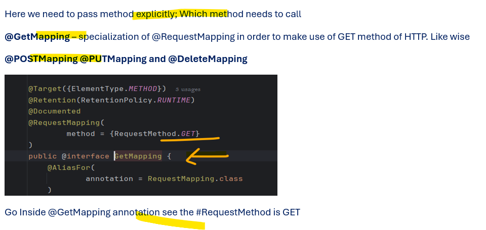
### Lets give id 2 which is not present
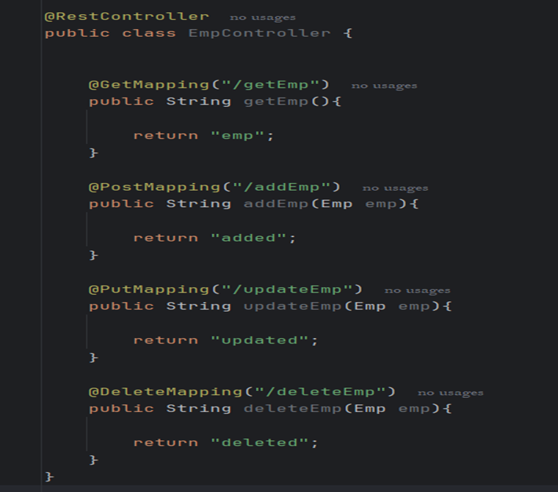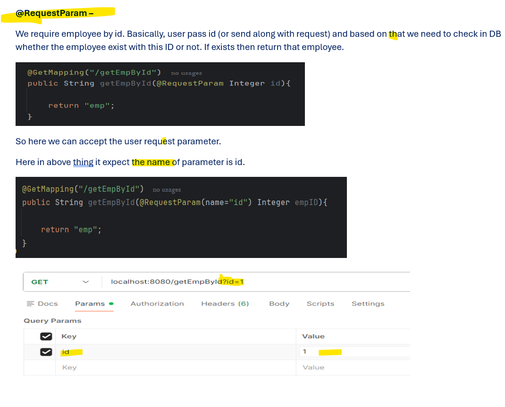
## Internal log showing ProductNotFoundException but client will get 500 Internal Error 
## Traditional way of handling the exeception - use try catch block.
### At controller
```java
@GetMapping("/getProduct/{productId}")
    public ResponseEntity<Product> getProductById(@PathVariable("productId") Integer productId){

        try{
            Product product = productService.findById(productId)
                    .orElseThrow(() -> new ProductNotFoundException("Product not found with id: " + productId));
            return ResponseEntity.ok(product);
        }catch (ProductNotFoundException e){
            throw e;
        }

    }
```
### Output
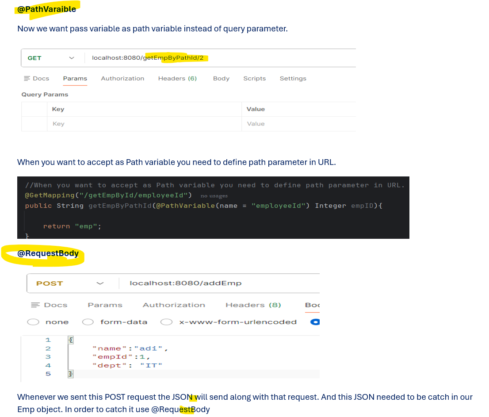
###
- Catching execption and throwing exception.
- This will not work. 
- Client/User won't understand what is happend with it.
### Do some meaningful stuff
```java
public class ErrorResponse {

    private LocalDateTime timeStamp;
    private String message;
    private String details;

    public ErrorResponse(LocalDateTime timeStamp, String message, String details) {
        this.timeStamp = timeStamp;
        this.message = message;
        this.details = details;
    }

    public LocalDateTime getTimeStamp() {
        return timeStamp;
    }

    public void setTimeStamp(LocalDateTime timeStamp) {
        this.timeStamp = timeStamp;
    }

    public String getMessage() {
        return message;
    }

    public void setMessage(String message) {
        this.message = message;
    }

    public String getDetails() {
        return details;
    }

    public void setDetails(String details) {
        this.details = details;
    }
}
```
### AT controller
```java
  @GetMapping("/getProduct/{productId}")
    public ResponseEntity<?> getProductById(@PathVariable("productId") Integer productId){

        try{
            Product product = productService.findById(productId)
                    .orElseThrow(() -> new ProductNotFoundException("Product not found with id: " + productId));
            return ResponseEntity.ok(product);
        }catch (ProductNotFoundException e){
            System.out.println("--------------Atitya");
            ErrorResponse productNotFound = new ErrorResponse(LocalDateTime.now(), e.getMessage(), "Product Not Found");
            return new ResponseEntity<>(productNotFound,HttpStatus.NOT_FOUND);
        }
    }
```
### Output
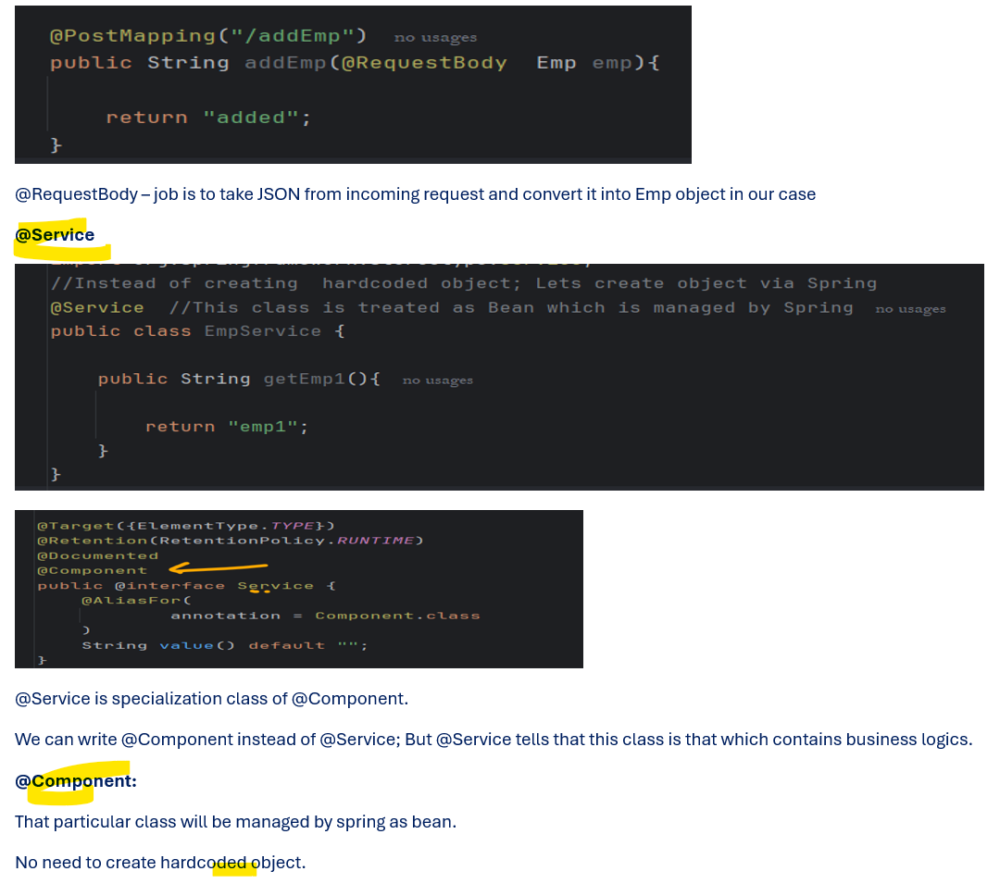
### This is the traditional way of handling the exception.
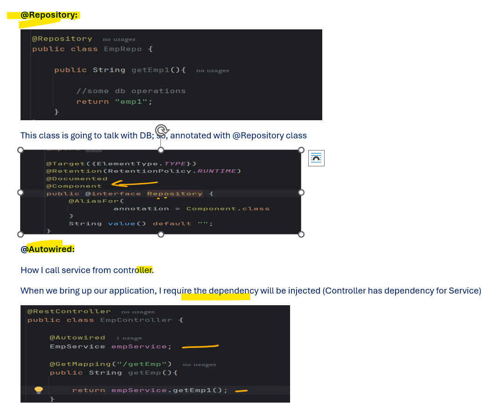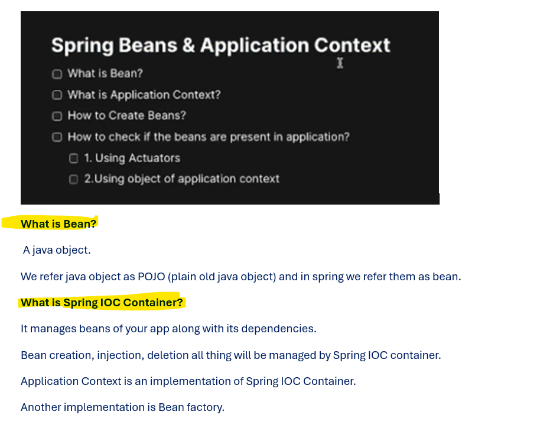
```
when we hit other api
again we get internal server error.
Not understanding what the exact error it is
For handling we need to again do same thing as above
```
### At controller
```java
 @GetMapping("/name/{name}")
    public ResponseEntity<?> getProductByName(@PathVariable String name){

        try{
            Product product = productService.findByName(name)
                    .orElseThrow(() -> new ProductNotFoundException("Product not found with name: " + name));
            return new ResponseEntity<>(product, HttpStatus.OK);
        }catch (ProductNotFoundException e){
            ErrorResponse productNotFound = new ErrorResponse(LocalDateTime.now(), e.getMessage(), "Product name Not Found");
            return new ResponseEntity<>(productNotFound,HttpStatus.NOT_FOUND);
        }
    }
```
###
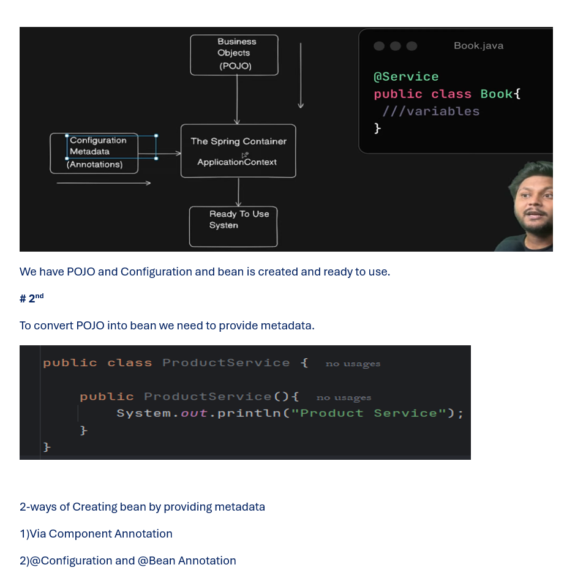
### Probleme
```
1) code duplication
for handling 1 api we write try-catch again for other api we do the same thing
2)maintenance challanges 
Need to change message everywhere in tradtional way of handling the exception
To  overcome aboove problem ExceptionalHandler comes in picture
```
###
```java
@RestController
@RequestMapping("/product/v1")
public class ProductController {

    @Autowired
    ProductService productService;

    @GetMapping("/getProduct/{productId}")
    public ResponseEntity<?> getProductById(@PathVariable("productId") Integer productId){

            Product product = productService.findById(productId)
                    .orElseThrow(() -> new ProductNotFoundException("Product not found with id: " + productId));
            return ResponseEntity.ok(product);

    }

    @GetMapping("/name/{name}")
    public ResponseEntity<?> getProductByName(@PathVariable String name){

            Product product = productService.findByName(name)
                    .orElseThrow(() -> new ProductNotFoundException("Product not found with name: " + name));
            return new ResponseEntity<>(product, HttpStatus.OK);

    }

    @PostMapping("/addProduct")
    public ResponseEntity<Product> addProduct(@RequestBody Product product){
        Product createdProduct = productService.addProduct(product);
        return new ResponseEntity<>(createdProduct,HttpStatus.CREATED);
    }

    @ExceptionHandler(ProductNotFoundException.class)
    public ResponseEntity<?> handleProductNotFoundException(ProductNotFoundException exception){
        ErrorResponse productNotFound = new ErrorResponse(LocalDateTime.now(), exception.getMessage(), "Product  Not Found");
        return new ResponseEntity<>(productNotFound,HttpStatus.NOT_FOUND);
    }
}
```
###
```
   @ExceptionHandler annotation is used for Exception handling
	Whcih exception you want to handle
    It is working as expected
```
### Probelm with ExceptionHandler
```
  Currently you are writing ExceptionHandler in Product Controller
    and for that particular class it will handle all exception.
	
	If you write other OrderController which throw ProductNotFoundException 
	 in that case your ExceptionHandler class present inside ProductController
	 will not able to handle that exception
```
###  Create Order controller
```java
@RestController
public class OrderController {

    @GetMapping("/getOrderById/{id}")
    public ResponseEntity<?> getOrder(@PathVariable Integer id){
        throw new ProductNotFoundException("Product for order is not found");
    }
}
```
###
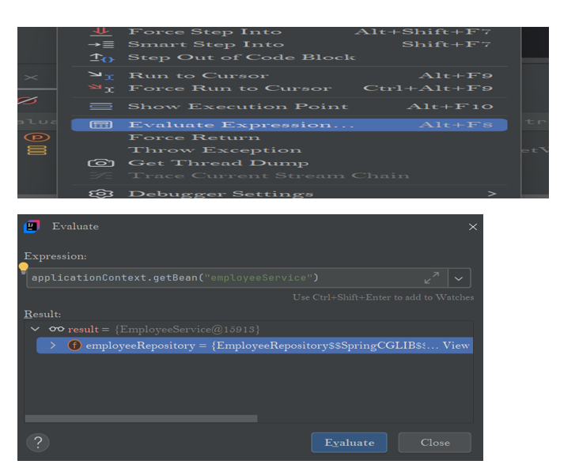
```
See here Exception Handler won't handle same execption which is 
comming from the other controller.

In order to resolve this
we need to add same exeptionHanlder code in OrderController
this will resolve the issue.
But again code duplicacy.

1000 controller 1000 Excption handler
solution is @ControllerAdvise

It will centralize our exception handling

```
###
```java
@ControllerAdvice 
public class GlobalExceptionHandler {

    @ExceptionHandler(ProductNotFoundException.class)
    public ResponseEntity<?> handleProductNotFoundException(ProductNotFoundException exception){
        ErrorResponse productNotFound = new ErrorResponse(LocalDateTime.now(), exception.getMessage(), "Product  Not Found");
        return new ResponseEntity<>(productNotFound, HttpStatus.NOT_FOUND);
    }
}
```
###
```
with this handle everything.
Previous problem is resolved.
```
### About @RestControllerAdvice
```
It is basically for
Response Body + Controller Advice
```
### Diff between @ControllerAdvice
``` 
IN case of @ControllerAdvice 
if we return String Error then it will serach for view name error.html like that.
So explicitly we need to mention @ResponseBody annotation. 
That stated that we return Response not view name

But if we use @RestControllerAdvice then it means that it contain response not view name

@ControllerAdvice use in Mvc app
@RestControolerAd use in restful api
```
###
```java
@RestController 
public class GlobalExceptionHandler {

    @ExceptionHandler(ProductNotFoundException.class)
    public ResponseEntity<?> handleProductNotFoundException(ProductNotFoundException exception){
        ErrorResponse productNotFound = new ErrorResponse(LocalDateTime.now(), exception.getMessage(), "Product  Not Found");
        return new ResponseEntity<>(productNotFound, HttpStatus.NOT_FOUND);
    }
}
```
## ABC


