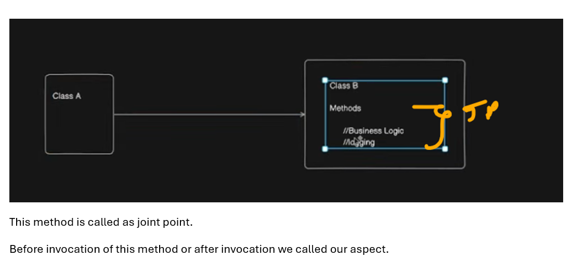
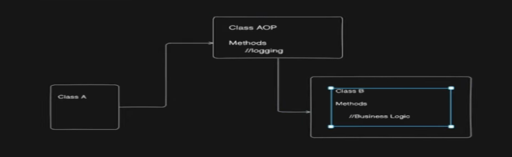
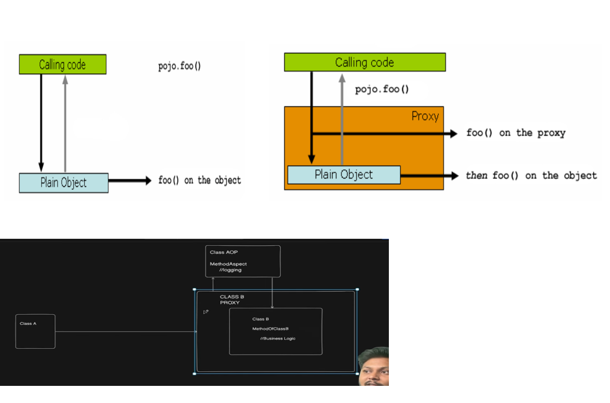
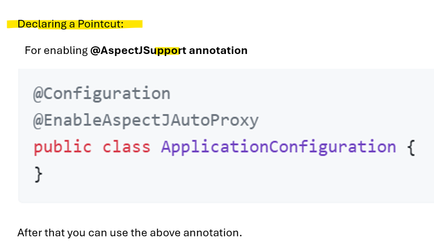
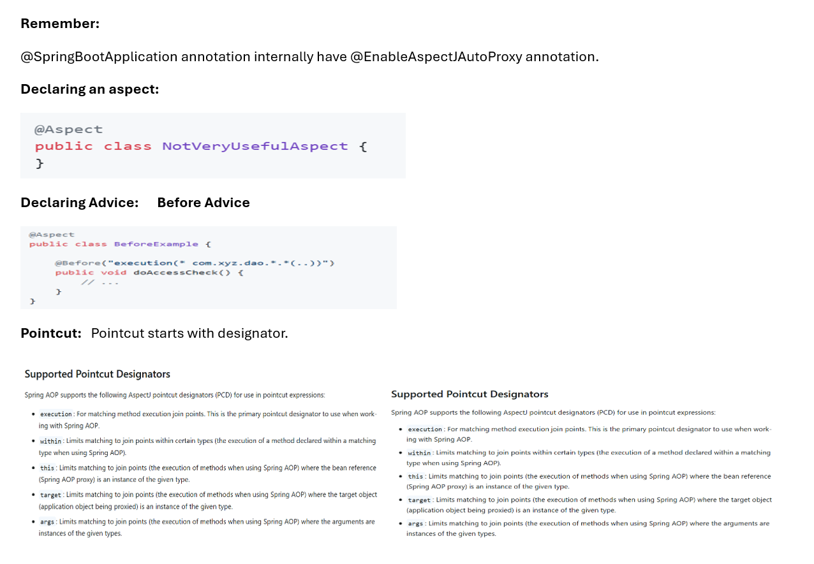
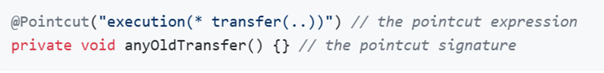
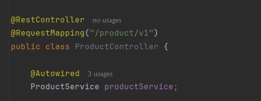

# Mastering @Aspect annotation & Spring AOP
```
 OOP has classes
   Similarly AOP has aspects.
   It is handling cross cutting concern. Things that can be done apart from business logics.
   Eg - Logging is your cross cutting concerns. 
    ie. Logging is different and businees logic is differnt.
	Logging is used for debugging purpose or Production monitoring later on.
	
	Class A calling to Class B which contain mehtod which has businees logic and logging.
	  logging is overhead for Class B method.
	  So this is cross cutting concern. So we can address via AOP.
	  
	  
	AOP terminology:
	Aspect:  It is used to handle cross cutting concerns. Transaction mgm or logging is best eg of 
	 cross cutting concerns.
	Aspect are implemented via normal java class with appropirate annotation.

    Joint Point: It is nothing but method execution.
```
###

###
```
 Advice: Action taken by aspect on particular joint point.
	 
	 Basically, we remove logging from this method of Class B.
	 
     Class AOP handling logging for method of Class B. 
	 
	  Now here We separate the concerns.
       
	   Class A want to call method of Class B; 
	         So first it will call method of AOP
              			 then it will route to Class B method.
						 
      For class AOP the method of Class B is Joint Point.
	  
      And for Class B the method of Class A is advice.

    Remember:
      Advice can be taken care after or before calling the method of class B.
      Diff types of Advice before or after  or around etc.
```

###
```
Pointcuts: 
	      Method Aspect of class AOP only needs to call for method of Class B.
	           Call it before or after or around 
			   So on which class you call the aspect.
			       on which method you want to call this aspect. 
			   Everything will be defined using pointcuts.
			   
			 Pointcuts is present on top of method of class AOP.
			  
			Pointcuts defined on which method the aspect should be applied.
```

```
 AOP Proxy:
	  Proxy is basically an object.
	  
	  
	  class SimplePojo implements POJO{}
	  
	  So in normal call dig 1st call happen.
	  But in case of proxy dig 2 will happen.
	  
			
		
			 

	Class A call first go to proxy of Class B.
	 
	Now proxy will check if we have any aspect for this particular class.
	  How it will check via pointcut expression.
	
	If yes then call this aspects do whatever is needed and 
	 then class A will call method of class B.
	 
	So proxy will invoke the aspect first and then method of class B is invoked.
	
	
	2 types of Proxy
	JDK dynamic proxy (if class implement interface then this is used)
	CGLIB proxy  (for normal class this is used)
```

### Main loggin pgm
```java
@Component //Coverted into Spring bean
@Aspect //1 Declaring an aspect.
public class LoggingAspect {

    //2. Here we add advices

    //3)I want to invoke this function before execution of addProduct() method of ProductService.
    //Give pointCut expression.
    // In @Before() annotation we need to add expression.
       //expression start with designator - execution (we give exact function which you want to intercept)
     //   return type of function is anything so *
      // Will give exact path to the function
    //    parameter of function can be anything represent by .. (dot dot)
    @Before("execution(* com.example.springdemoapp.service.ProductService.addProduct(..))")
    public void log(){
        System.out.println("Aspect log called");
    }
}
```
### Service
```java
@Service
public class ProductService {

    private final ProductRepository productRepository;

    public ProductService(ProductRepository productRepository) {
        this.productRepository = productRepository;
        System.out.println("ProductService Created");
    }

    public Product addProduct(Product product){
        System.out.println(" add Product is called");
        return productRepository.save(product);
    }

    public Optional<Product> findById(Integer id){
        return productRepository.findById(id);
    }

    public Optional<Product> findByName(String name){
        return productRepository.findByName(name);
    }

    public List<Product> getAllProducts(){
        return productRepository.findAll();
    }
}
```
### Controller
```java
@RestController
@RequestMapping("/product/v1")
public class ProductController {

    @Autowired
    ProductService productService;

    @GetMapping("/getProduct/{productId}")
    public ResponseEntity<?> getProductById(@PathVariable("productId") Integer productId){

            Product product = productService.findById(productId)
                    .orElseThrow(() -> new ProductNotFoundException("Product not found with id: " + productId));
            return ResponseEntity.ok(product);

    }

    @GetMapping("/name/{name}")
    public ResponseEntity<?> getProductByName(@PathVariable String name){

            Product product = productService.findByName(name)
                    .orElseThrow(() -> new ProductNotFoundException("Product not found with name: " + name));
            return new ResponseEntity<>(product, HttpStatus.OK);

    }

    @PostMapping("/addProduct")
    public ResponseEntity<Product> addProduct(@RequestBody Product product){
        Product createdProduct = productService.addProduct(product);
        System.out.println("Product Controller");
        return new ResponseEntity<>(createdProduct,HttpStatus.CREATED);
    }


}
```
### Output
```
Aspect log called
 add Product is called
Product Controller
```
### Analysis
```
I debug this this
so controller act as client.
So client call to proxy - and proxy first call to aspect.
  CGLIB proxy is visible
then addProduct() method will be called.
so that above output printed.
```
### After advise
- After execution of addProduct() method i.e. jointpoint this advice is getting called
```
 add Product is called
Aspect log called
Product Controller
```
```java
@Component
@Aspect
public class LoggingAspect {


    @After("execution(* com.example.springdemoapp.service.ProductService.addProduct(..))")
    public void log(){
        System.out.println("Aspect log called");
    }
}
```
### Now you require all the function in the ProductService to be intercepted
```java
@Component
@Aspect
public class LoggingAspect {


    @After("execution(* com.example.springdemoapp.service.ProductService.*(..))")
    public void log(){
        System.out.println("Aspect log called");
    }
}
```
### If you want all the classes inside Service package is needed to be intercepted
```java
@Component
@Aspect
public class LoggingAspect {


    @After("execution(* com.example.springdemoapp.service.*.*(..))")
    public void log(){
        System.out.println("Aspect log called");
    }
}
```
### Around Aspect
```
 Around Aspect:
     It is in between @Before and @After Aspect.
	 IN this case you need to called explicitly the jointpoint.
	  For that u can use PreceddingJOintPoint.
```
```java
@Component
@Aspect
public class LoggingAspect {


    @Around("execution(* com.example.springdemoapp.service.*.*(..))")
    public Object log(ProceedingJoinPoint joinPoint) throws Throwable {
        System.out.println("Aspect  log  called -- before");
        Object result  = joinPoint.proceed();
        System.out.println("Aspect log after called");
        return result;
    }
}
```
### output
```
Aspect  log  called -- before
 add Product is called
Aspect log after called
Product Controller
```
### We can declare the Pointcut also called as Named Pointcut

```java
@Component
@Aspect
public class LoggingAspect {

    @Pointcut("execution(* com.example.springdemoapp.service.*.*(..))")
    private void anyOldTransfer() {}

    @Around("anyOldTransfer()")
    public Object log(ProceedingJoinPoint joinPoint) throws Throwable {
        System.out.println("Aspect  log  called -- before");
        Object result  = joinPoint.proceed();
        System.out.println("Aspect log after called");
        return result;
    }
}
```
### Output same as above
### within Designator - PointCut Designators
```
  within: U want to apply pointcuts to the methods of respective class
	I want to apply on all the methods of ProductService
```
```java
@Component
@Aspect
public class LoggingAspect {

    @Pointcut("within(com.example.springdemoapp.service.ProductService)")
    private void anyOldTransfer() {}

    @Around("anyOldTransfer()")
    public Object log(ProceedingJoinPoint joinPoint) throws Throwable {
        System.out.println("Aspect  log  called -- before");
        Object result  = joinPoint.proceed();
        System.out.println("Aspect log after called");
        return result;
    }
}
```
- It is work with all the methods of ProductService class
- cross verify -- working fine
## @within
```
 
   @within - works for annotation
   I want to apply pointcut on the class which is annotated with @Service.
   
   Careful: U want to apply pointcut on @Service annotation
    so use @within
```
```java
@Component
@Aspect
public class LoggingAspect {

    @Pointcut("@within(org.springframework.stereotype.Service)")
    private void anyOldTransfer() {}

    @Around("anyOldTransfer()")
    public Object log(ProceedingJoinPoint joinPoint) throws Throwable {
        System.out.println("Aspect  log  called -- before");
        Object result  = joinPoint.proceed();
        System.out.println("Aspect log after called");
        return result;
    }
}
```
### Output - working fine
### About @annotation 
-   @annotation - use for function
- So i want to add aspect on function annotatied with @PostMapping
### At controller
```java
    @PostMapping("/addProduct")
    public ResponseEntity<Product> addProduct(@RequestBody Product product){
        Product createdProduct = productService.addProduct(product);
        System.out.println("Product Controller");
        return new ResponseEntity<>(createdProduct,HttpStatus.CREATED);
    }
```
### Aspect
```java
@Component
@Aspect
public class LoggingAspect {

    @Pointcut("@annotation(org.springframework.web.bind.annotation.PostMapping)")
    private void anyOldTransfer() {}

    @Around("anyOldTransfer()")
    public Object log(ProceedingJoinPoint joinPoint) throws Throwable {
        System.out.println("Aspect  log  called -- before");
        Object result  = joinPoint.proceed();
        System.out.println("Aspect log after called");
        return result;
    }
}
```
### Output
```
Aspect  log  called -- before
 add Product is called
Product Controller
Aspect log after called
```
### target designator
```
 target:
    @Pointcut("target(com.example.springdemoapp.service.ProductService)")
    private void anyOldTransfer() {}
	
	So whereever we create  object of ProductService
	 and call any method from it there there aspect will be getting called.
```

```java
@Component
@Aspect
public class LoggingAspect {

    @Pointcut("target(com.example.springdemoapp.service.ProductService)")
    private void anyOldTransfer() {}

    @Around("anyOldTransfer()")
    public Object log(ProceedingJoinPoint joinPoint) throws Throwable {
        System.out.println("Aspect  log  called -- before");
        Object result  = joinPoint.proceed();
        System.out.println("Aspect log after called");
        return result;
    }
}
```
- Working as expected
## @target designator
- we focus on @Service --- where ever the object of this are used their all methods are intercepted.
```java
@Component
@Aspect
public class LoggingAspect {

    @Pointcut("@target(org.springframework.stereotype.Service)")
    private void anyOldTransfer() {}

    @Around("anyOldTransfer()")
    public Object log(ProceedingJoinPoint joinPoint) throws Throwable {
        System.out.println("Aspect  log  called -- before");
        Object result  = joinPoint.proceed();
        System.out.println("Aspect log after called");
        return result;
    }
}
```
###
```
The designator which is started via @ work with annotation
and rest are work with classes.
```
### U can combine 2 or more expression using and/or
- all the method inside particualar class and all the method inside the @Service annotation should be intercepted.
- all the expression true then methods are intercepted
```java
@Component
@Aspect
public class LoggingAspect {

    @Pointcut("within(com.example.springdemoapp.service.ProductService) && @within(org.springframework.stereotype.Service)")
    private void anyOldTransfer() {}

    @Around("anyOldTransfer()")
    public Object log(ProceedingJoinPoint joinPoint) throws Throwable {
        System.out.println("Aspect  log  called -- before");
        Object result  = joinPoint.proceed();
        System.out.println("Aspect log after called");
        return result;
    }
```
### U can also combine pointcut expression
```
@Pointcut("within(com.example.springdemoapp.service.ProductService)" +
            "&& @within(org.springframework.stereotype.Service)")
```


